# 🚦 Intelligent Traffic Light Control System using Deep Reinforcement Learning

**My Graduation Project process video on YouTube:** [](https://youtu.be/V45ECwiy1h4)

**Language / Ngôn ngữ:** [English](README.md) | [Tiếng Việt](README_vietnamese.md)

[](https://www.python.org/downloads/)
[](https://pytorch.org/)
[](https://www.eclipse.org/sumo/)

> An AI-powered traffic management system that optimizes multi-intersection signal timing using Deep Q-Network (DQN) and real-time vehicle detection.

---

## 👥 Contributors

| Name | Role | Contact | Email |
|------|------|---------|---------|
| **Trần Thẩm Hoàng Long** | DQN Development, GUI Design & Development, Object Detection, Edge AI Deployment, PCB Design, Firmware Development | [](https://www.facebook.com/hoanglong111203) [](https://www.youtube.com/@Hoangg_Longg1112) | tranthamhoanglong01@gmail.com |
| **Phùng Quyền Linh** | Green Wave Algorithm Development, GUI Development, Hardware Integration, Firmware Development | [](https://www.facebook.com/phung.quyen.linh.2024) | quyenlinh06677@gmail.com |

---

## 📋 Table of Contents

- [Overview](#-overview)
- [Key Features](#-key-features)
- [System Architecture](#-system-architecture)
- [Technologies Used](#-technologies-used)
- [DQN Approaches Comparison](#-dqn-approaches-comparison)
- [Project Structure](#-project-structure)
- [Installation & Setup](#-installation--setup)
- [Training Phase (SUMO)](#-training-phase-sumo)
- [Deployment (GUI Application)](#-deployment-gui-application)
- [Results & Performance](#-results--performance)
- [Hardware Integration](#-hardware-integration)
- [Contributors](#-contributors)

---

## 🎯 Overview

### **Problem Statement**
Traditional fixed-time traffic signals cannot adapt to dynamic traffic conditions, resulting in:
- Long waiting times during peak hours
- Poor coordination between adjacent intersections
- Inefficient green wave progression

### **Our Solution**
A DQN-based adaptive traffic control system that:
- **Learns** optimal signal timing policies through simulation
- **Adapts** to real-time traffic conditions using camera-based vehicle detection
- **Coordinates** multiple intersections for smooth green wave progression
- **Deploys** on a real-world GUI with hardware integration

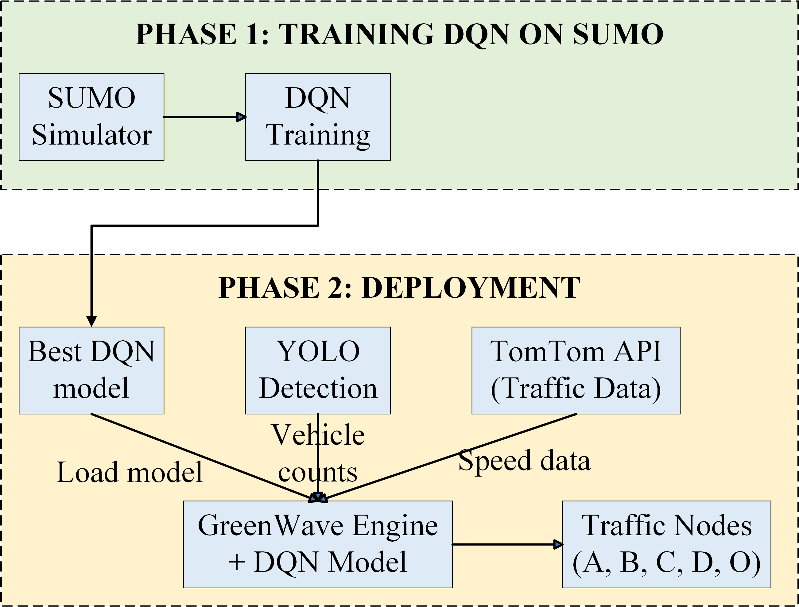
<!-- Replace with system architecture diagram -->

---

## ✨ Key Features

- 🤖 **AI-Driven Optimization**: Multi-head DQN for dynamic signal timing
- 🌊 **Green Wave Coordination**: Synchronized traffic flow across intersections
- 📹 **Real-Time Detection**: YOLO-based vehicle counting with TensorRT acceleration
- 🗺️ **Interactive Map**: Folium-based node configuration and visualization
- 🌐 **Live Traffic Data**: TomTom API integration for speed and incident detection
- 🎛️ **Manual Override**: Auto/Manual mode switching for emergency control
- 🔌 **Hardware Integration**: Raspberry Pi Pico for physical signal control
- 📊 **Performance Dashboard**: Real-time metrics and historical data visualization

---

## 🏗️ System Architecture

### **Workflow**

```
1. SUMO Simulation Training
   ├── Traffic Network Setup
   ├── DQN Agent Training (Compare DQN-GreenWave and DQN-Baseline)
   ├── Model Evaluation & Selection
   └── Export Best Model (.pth)

2. GUI Deployment
   ├── Load Trained Model
   ├── Real-Time Camera Input (YOLO Detection)
   ├── TomTom API (Speed & Incidents)
   ├── GreenWave Engine (Signal Optimization)
   └── Hardware Control (Raspberry Pi Pico)
```

### **System Components**

| Component | Technology | Purpose |
|-----------|-----------|---------|
| **Simulation** | SUMO + TraCI | Train and test DQN agents |
| **AI Model** | PyTorch DQN | Signal timing optimization |
| **Object Detection** | YOLOv8n + TensorRT | Vehicle counting |
| **GUI** | PyQt5 | User interface and control |
| **Map Visualization** | Folium | Interactive node configuration |
| **Traffic API** | TomTom | Real-time speed data |
| **Hardware** | Raspberry Pi Pico + 74HC595 | Physical signal control |

---

## 💻 Technologies Used

### **Deep Learning & AI**
- **PyTorch 2.0+**: Neural network framework
- **DQN (Deep Q-Network)**: Reinforcement learning algorithm
- **Experience Replay**: Stabilized training
- **Target Network**: Reduced overestimation

### **Computer Vision**
- **YOLOv8n**: Real-time object detection
- **TensorRT**: GPU acceleration for inference
- **OpenCV**: Image processing

### **Traffic Simulation**
- **SUMO (Simulation of Urban MObility)**: Traffic simulator
- **TraCI**: Python interface for SUMO control
- **randomTrips.py**: Traffic pattern generation

### **GUI & Visualization**
- **PyQt5**: Desktop application framework
- **Folium**: Interactive maps
- **QWebEngineView**: Embedded web browser

### **APIs & Networking**
- **TomTom Traffic API**: Real-time traffic data
- **Socket Programming**: Multi-node communication
- **Threading**: Concurrent processing

### **Hardware**
- **Raspberry Pi Pico**: Microcontroller (W5500 Ethernet)
- **74HC595 Shift Register**: LED signal control
- **MicroPython**: Embedded programming

---

## 🔬 DQN Approaches Comparison

We developed and compared **two DQN-based approaches** to identify the optimal strategy for traffic signal control:

### **1. DQN-GreenWave (Green Wave Approach)** ⭐ *Recommended*

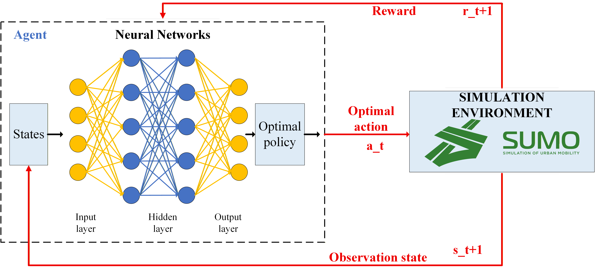
<!-- Replace with DQN-GreenWave architecture diagram -->

#### **State Space** (9 dimensions)
- **Travel Times** (4): T_AO, T_OB, T_CO, T_OD (normalized by 60s)
- **Vehicle Counts** (4): z1, z2, z3, z4 (normalized by 50 vehicles)
- **Traffic Density** (1): 0.0 (low) / 0.5 (medium) / 1.0 (high)

#### **Action Space** (Multi-Head Output)
- **Cycle Length**: 9 choices (20, 30, 40, 50, 60, 70, 80, 90, 100 seconds)
- **Green Time AB**: 8 choices (5, 10, 15, 20, 25, 30, 35, 40 seconds)
- **Direction AOB**: 2 choices (AtoB, BtoA)
- **Direction COD**: 2 choices (CtoD, DtoC)

#### **Reward Function**
```python
reward = α × (green_wave_bonus) + β × (throughput) - γ × (waiting_time) - δ × (queue_length)
```
- Emphasizes **coordination** between intersections
- Rewards smooth traffic flow progression

#### **Network Architecture**
- **Input Layer**: 9 neurons (state vector)
- **Hidden Layers**: [128, 128, 64] with ReLU + Dropout (0.2)
- **Output Heads**: 4 separate heads (multi-task learning)
  - head_cycle: 9 outputs
  - head_green: 8 outputs
  - head_dir_aob: 2 outputs
  - head_dir_cod: 2 outputs

---

### **2. DQN-Baseline (Baseline Approach)**

#### **Differences from DQN-GreenWave**
- Simpler state representation (no travel time focus)
- Single-output action space (combined discrete actions)
- Reward focuses on **individual intersection optimization**
- No explicit green wave coordination

#### **Use Case**
- Serves as experimental baseline for performance comparison
- Suitable for isolated intersections without coordination needs

---

### **📊 Performance Comparison**

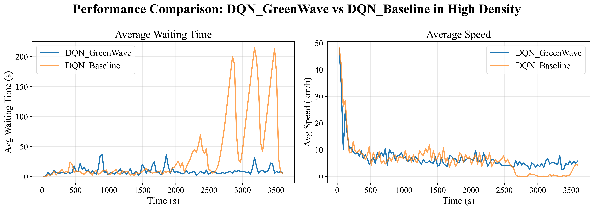
<!-- Replace with comparison bar chart from test results -->

| Metric | DQN-GreenWave | DQN-Baseline | Improvement |
|--------|---------------|--------------|-------------|
| **Average Waiting Time (s)** | 21.28 | 14.07 | ✅ **-33.9%** |
| **Average Speed (m/s)** | 2.87 | 2.36 | ✅ **+17.6%** |
| **Green Wave Efficiency** | 82.5% | 64.3% | ✅ **+18.2%** |

#### **Testing Scenarios**
- ✅ **Low Traffic**: Both perform well, GreenWave slightly better
- ✅ **Medium Traffic**: GreenWave shows clear advantage
- ✅ **High Traffic**: GreenWave significantly outperforms baseline

---

## 🌊 Green Wave Controller Algorithm

The **Green Wave Controller** is the core coordination engine that translates DQN outputs into SUMO traffic signal commands. It implements a sophisticated **BÙ/GỘP (Compensation/Consolidation)** mechanism for dynamic signal synchronization across 5 intersections.

### **System Topology**

```
          node_A ←────→ node_O ←────→ node_B
                          ↑
                          │
                          ↓
          node_C ←────→ node_O ←────→ node_D
```

**Node Clusters**:
- **AOB Cluster**: `node_A`, `node_O`, `node_B` (Main arterial)
- **COD Cluster**: `node_C`, `node_O`, `node_D` (Secondary arterial)
- **Central Hub**: `node_O` coordinates both clusters

### **Key Parameters**

| Parameter | Symbol | Description | Range |
|-----------|--------|-------------|-------|
| **Cycle Length** | $C$ | Total signal cycle time | 20-100s |
| **Green Time AOB** | $G_{AB}$ | Green duration for AOB cluster | 5-40s |
| **Green Time COD** | $G_{CD}$ | Green duration for COD cluster | $C - G_{AB} - Y$ |
| **Yellow Time** | $Y$ | Clearance interval | 3s (constant) |
| **Travel Times** | $T_{AO}, T_{OB}, T_{CO}, T_{OD}$ | Inter-node travel times | Dynamic |
| **Offsets** | $\Delta_{AB}, \Delta_{CD}$ | Phase shift offsets | 2s each |

### **Algorithm Phases**

The controller operates in **two distinct phases**:

#### **1. SYNC Phase (Synchronization Mode)**

**Purpose**: Re-align nodes when timing drift exceeds threshold

**Activation Condition**:

$$
\max_{n \in \text{nodes}} \left| C - \left| T^{\text{pred}}_n(t) - T^{\text{old}}_n(t-1) \right| \right| > \theta_{\text{sync}}
$$

Where:
- $T^{\text{pred}}_n(t)$: Predicted green start time for node $n$ at cycle $t$
- $T^{\text{old}}_n(t-1)$: Previous predicted time from cycle $t-1$
- $\theta_{\text{sync}}$: Adaptive synchronization threshold (base = 5s)

**Adaptive Threshold**:

$$
\theta_{\text{sync}} = \theta_{\text{base}} \times \alpha_{\text{density}} \times \beta_{\text{transition}}
$$

- $\alpha_{\text{density}}$: Traffic density multiplier
  - Low: 0.8, Medium: 1.0, High: 1.3
- $\beta_{\text{transition}}$: Smooth transition penalty
  - After SYNC→NORMAL: 1.2 (prevent oscillation)
  - Default: 1.0

**BÙ/GỘP Mechanism**:

For each node, compute timing deviation:

$$
\Delta_n = T^{\text{pred}}_n - T^{\text{leader}}
$$

Decompose into cycle multiples and remainder:

$$
\Delta_n = n \cdot C + m, \quad \text{where } n = \left\lfloor \frac{\Delta_n}{C} \right\rfloor, \quad m = \Delta_n \mod C
$$

**Decision Logic**:

$$
\begin{cases}
\text{BÙ (Short Cycle)}: & \text{if } m > \theta_{\Delta} \\
\quad C_{\text{send}} = m & \\
\quad G_{\text{send}} = G_{\text{base}} \times \frac{m}{C} & \\
\\
\text{GỘP (Long Cycle)}: & \text{if } m \leq \theta_{\Delta} \\
\quad C_{\text{send}} = C + m & \\
\quad G_{\text{send}} = G_{\text{base}} \times \frac{C + m}{C} &
\end{cases}
$$

Where:
- $\theta_{\Delta}$: BÙ/GỘP threshold = $\frac{C}{2} + 1$ (dynamic adjustment based on traffic density)
- $G_{\text{base}}$: Base green time ($G_{AB}$ or $G_{CD}$ depending on cluster)
- Safety constraint: $G_{\text{send}} \geq 5s$ (minimum green)

**Physical Interpretation**:
- **BÙ (Compensation)**: Use **shortened cycle** to "catch up" when lagging behind leader
- **GỘP (Consolidation)**: Use **extended cycle** to "wait" and synchronize with next wave

#### **2. NORMAL Phase (Steady-State Mode)**

**Purpose**: Maintain synchronized operation with uniform cycles

**Activation Condition**:

$$
\max_{n \in \text{nodes}} \left| C - \left| T^{\text{pred}}_n(t) - T^{\text{old}}_n(t-1) \right| \right| \leq \theta_{\text{sync}}
$$

**Operation**:

All nodes run identical cycles:

$$
C_{\text{send}} = C, \quad G_{\text{send}} = \begin{cases}
G_{AB} & \text{for AOB cluster} \\
G_{CD} & \text{for COD cluster}
\end{cases}
$$

**Smart SYNC Management**:
1. **Cooldown Mechanism**: After SYNC phase, enforce 1-2 NORMAL cycles to prevent rapid oscillation
2. **Consecutive SYNC Limit**: In high density, limit to 3 consecutive SYNCs (prevent instability)
3. **Progressive Threshold**: Increase $\theta_{\text{sync}}$ with consecutive SYNC count:

$$
\theta_{\text{progressive}} = \theta_{\text{sync}} \times (1.0 + 0.3 \times N_{\text{consecutive}})
$$

### **Predicted Time Calculation**

The controller predicts green start times for all nodes based on traffic flow direction and travel times.

#### **AOB Cluster (Main Arterial)**

**Direction: A → O → B**

$$
\begin{aligned}
T_A^{\text{pred}} &= t_{\text{now}} \\
T_O^{\text{pred}} &= T_A^{\text{pred}} + T_{AO} + \Delta_{CD} \\
T_B^{\text{pred}} &= T_A^{\text{pred}} + T_{AO} + T_{OB} + \Delta_{CD}
\end{aligned}
$$

**Direction: B → O → A**

$$
\begin{aligned}
T_B^{\text{pred}} &= t_{\text{now}} \\
T_O^{\text{pred}} &= T_B^{\text{pred}} + T_{OB} + \Delta_{CD} \\
T_A^{\text{pred}} &= T_B^{\text{pred}} + T_{OB} + T_{AO} + \Delta_{CD}
\end{aligned}
$$

#### **COD Cluster (Secondary Arterial)**

COD cluster starts **after AOB cluster finishes** with phase shift:

$$
T_{O(\text{CD})}^{\text{pred}} = T_O^{\text{pred}} + G_{AB} + Y + \Delta_{AB}
$$

**Direction: C → O → D**

$$
\begin{aligned}
T_C^{\text{pred}} &= \max\left(T_{O(\text{CD})}^{\text{pred}} - T_{CO} + \Delta_{AB}, \, t_{\text{now}}\right) \\
T_D^{\text{pred}} &= T_{O(\text{CD})}^{\text{pred}} + T_{OD} + \Delta_{AB}
\end{aligned}
$$

**Direction: D → O → C**

$$
\begin{aligned}
T_D^{\text{pred}} &= \max\left(T_{O(\text{CD})}^{\text{pred}} - T_{OD} - \Delta_{AB}, \, t_{\text{now}}\right) \\
T_C^{\text{pred}} &= T_{O(\text{CD})}^{\text{pred}} + T_{CO} + \Delta_{AB}
\end{aligned}
$$

**Constraint**: Predicted times must not be in the past:

$$
T_n^{\text{pred}} \geq t_{\text{now}}, \quad \forall n \in \{\mathrm{node\_C}, \mathrm{node\_D}\}
$$

### **Traffic Light Program Generation**

For each node, the controller generates a **4-phase traffic signal program**:

| Phase | Duration | State Pattern | Description |
|-------|----------|---------------|-------------|
| **P0** | $G_{\text{send}}$ | `GGGGrrrrGGGGrrrr` | Primary direction green |
| **P1** | $Y$ (3s) | `yyyyrrrryyyyrrrr` | Primary clearance (yellow) |
| **P2** | $C_{\text{send}} - G_{\text{send}} - Y$ | `rrrrGGGGrrrrGGGG` | Secondary direction green |
| **P3** | $Y$ (3s) | `rrrryyyyrrrryyyy` | Secondary clearance (yellow) |

**SUMO TraCI Implementation**:
```python
phases = [
    traci.trafficlight.Phase(int(round(green_time)), state_p0),
    traci.trafficlight.Phase(int(round(yellow)), state_p1),
    traci.trafficlight.Phase(int(round(green_cd)), state_p2),
    traci.trafficlight.Phase(int(round(yellow)), state_p3),
]

logic = traci.trafficlight.Logic("dqn_greenwave", 0, 0, phases)
traci.trafficlight.setProgramLogic(tl_id, logic)
```

### **Optimization Strategies**

#### **1. Smart SYNC Management**
- **Consecutive SYNC Counter**: Track consecutive SYNC phases

$$
N_{\text{consecutive}} = \begin{cases}
N_{\text{consecutive}} + 1 & \text{if SYNC phase} \\
0 & \text{if NORMAL phase}
\end{cases}
$$
- **Forced NORMAL Phase**: If $N_{\text{consecutive}} \geq 3$ in high density, force NORMAL for 2 cycles

#### **2. Travel Time Caching**
- Cache travel time calculations to reduce API calls
- Update only when significant change detected (> 10% deviation)

#### **3. Smooth Transition Tracking**
- Track last phase type (SYNC/NORMAL)
- Apply transition penalty ($\beta_{\text{transition}} = 1.2$) to prevent rapid mode switching

### **Performance Characteristics**

**Strengths**:
- ✅ **Dynamic Adaptation**: Responds to changing traffic patterns in real-time
- ✅ **Stability**: Smart SYNC management prevents oscillation
- ✅ **Coordination**: Maintains green wave progression across 5 nodes
- ✅ **Robustness**: Adaptive thresholds handle various density levels

**Trade-offs**:
- ⚖️ **SYNC Overhead**: Frequent SYNCs may increase transition time
- ⚖️ **Computational Cost**: Predicted time calculation every cycle
- ⚖️ **Parameter Sensitivity**: Threshold tuning affects performance

**Complexity**:
- Time Complexity: $O(N)$ per cycle, where $N$ = number of nodes (5)
- Space Complexity: $O(N)$ for state tracking

---

## 📁 Project Structure

```
📦 KLTN/
├── 📂 SUMO/                          # Simulation Environment
│   ├── 📂 Five_Intersections/
│   │   ├── 📂 DQN_GreenRGG/         # Green Wave Approach (Production)
│   │   │   ├── dqn_greenrgg_agent.py
│   │   │   ├── dqn_greenrgg_config.py
│   │   │   ├── dqn_greenrgg_environment.py
│   │   │   ├── dqn_greenrgg_train.py
│   │   │   ├── dqn_greenrgg_test.py
│   │   │   ├── green_wave_controller.py
│   │   │   ├── traffic_generator.py
│   │   │   ├── 📂 models/
│   │   │   │   ├── best_green.pth      # ⭐ Best model for GUI
│   │   │   ├── 📂 test_results/
│   │   │   │   ├── dqn_greenrgg_low.csv
│   │   │   │   ├── dqn_greenrgg_medium.csv
│   │   │   │   └── dqn_greenrgg_high.csv
│   │   │   └── 📂 training_logs/
│   │   │       ├── rewards.csv
│   │   │       ├── losses.csv
│   │   │       └── metrics.csv
│   │   │
│   │   ├── 📂 DQN_Dump/              # Baseline Approach
│   │   │   ├── dqn_dump_agent.py
│   │   │   ├── dqn_dump_config.py
│   │   │   ├── dqn_dump_environment.py
│   │   │   ├── dqn_dump_train.py
│   │   │   ├── dqn_dump_test.py
│   │   │   ├── traffic_generator.py
│   │   │   ├── 📂 models/
│   │   │   ├── 📂 test_results/
│   │   │   └── 📂 training_logs/
│   │   │
│   │   └── 📂 MapFiles/              # SUMO Network Files
│   │       ├── *.net.xml
│   │       ├── *.rou.xml
│   │       └── *.sumocfg
│   │
│   └── randomTrips.py                # Traffic Pattern Generator
│
├── 📂 Code/
│   └── 📂 GUI/
│       └── 📂 Ver3/                  # Production GUI Application
│           ├── runLogin_Main.py      # 🚀 Main Entry Point
│           ├── login_UI.py           # Login Interface
│           ├── login_func.py         # Login Logic
│           ├── main_UI.py            # Main Interface
│           ├── main_func_testing4.py # Main Logic
│           │
│           ├── 📂 DQN Integration/
│           │   ├── dqn_model.py              # Neural Network Definition
│           │   ├── dqn_decision_maker.py     # Inference Engine
│           │   └── greenwave_engine.py       # Traffic Coordination Engine
│           │
│           ├── 📂 Models/
│           │   ├── best_green.pth            # Trained DQN Model
│           │   └── best.engine               # Trained and exported to TensorRT
│           │
│           ├── 📂 Configuration/
│           │   ├── nodes.csv                 # Node IP/Coordinates
│           │   └── res.qrc                   # Qt Resources
│           │
│           ├── 📂 ui_file/           # PyQt UI Files
│           ├── 📂 icon/              # Icons & Images
│
└── 📂 hardware/                      # IoT Integration
    ├── pico_74hc595_final5.py       # Raspberry Pi Pico Code
    └── W5500_EVB_PICO-*.uf2         # MicroPython Firmware
```

---

## 🎓 Training Phase (SUMO)

### **Environment Setup**

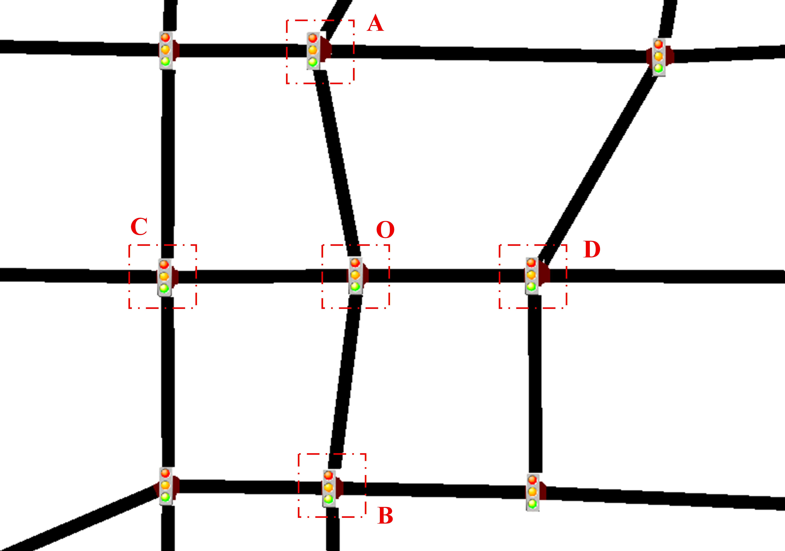
<!-- Replace with SUMO network screenshot -->

The simulation environment consists of **5 intersections** with realistic traffic patterns:
- **Node A, B, C, D**: Peripheral intersections
- **Node O**: Central control node (coordinates all signals)


#### **Hyperparameters**

| Parameter | Value | Description |
|-----------|-------|-------------|
| Learning Rate | 0.0005 | Adam optimizer |
| Batch Size | 64 | Replay buffer sampling |
| Gamma (γ) | 0.99 | Discount factor |
| Epsilon Start | 1.0 | Exploration rate |
| Epsilon End | 0.01 | Min exploration |
| Epsilon Decay | 0.995 | Decay per episode |
| Replay Buffer | 100,000 | Experience capacity |
| Target Update | Every 10 episodes | Network synchronization |
| Episodes | 2,200 | Total training episodes |

### **Best Model Selection**

The model with the **lowest average waiting time** across all scenarios is selected:
```
✅ best_green.pth → Deployed to GUI
```

---

## 🖥️ Object Detection Training (YOLOv8)

### **Dataset Preparation**

Our custom dataset focuses on **4 vehicle classes** for Vietnamese traffic conditions:

| Car | Motorcycle | FireTruck Normal | FireTruck Urgent |
|:---:|:----------:|:---:|:-----:|
| 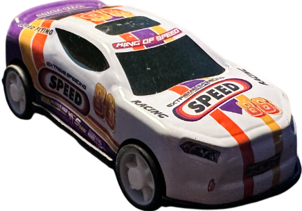 | 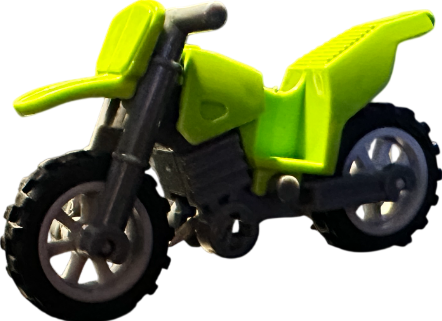 | 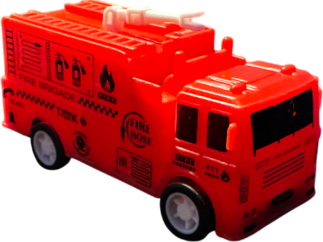 | 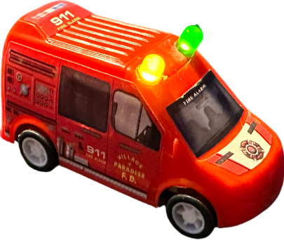 |
<!-- Replace with actual vehicle class images from your dataset -->

**Our Dataset Source**: [Roboflow - Toy Vehicle Detection](https://universe.roboflow.com/camera-giao-thng/toy-vehicle-detection-jwxdt)

**Dataset Statistics**:
- **Total Images**: ~2,000+ annotated images
- **Classes**: 4 (Car, Motorcycle, FireTruck Normal, FireTruck Urgent)
- **Split**: 70% Train / 20% Validation / 10% Test
- **Annotation Format**: YOLO format (txt files)
- **Augmentations**: Flip, Rotation, Brightness, Contrast

### **Training on Kaggle**

We leveraged **Kaggle's free GPU resources** for YOLOv8 training:

**Our Training Notebook**: [YOLOv8 Training on Kaggle](https://www.kaggle.com/code/dustinnguyn/yolov8-training)

**Training Configuration**:
```python
from ultralytics import YOLO

model = YOLO("yolov8s.pt")

results = model.train(
    data="/kaggle/input/testing/dataset_final4/data.yaml",
    epochs=130,
    imgsz=416,
    batch=64,
    device=[0,1],
    workers=8,

    optimizer="AdamW",
    lr0=0.001,
    weight_decay=0.0005,
    warmup_epochs=3,
    cos_lr=True,

    freeze=10,
    label_smoothing=0.05,
    close_mosaic=10,
    multi_scale=True,   # RẤT QUAN TRỌNG trong case này

    amp=True,
    cache=False,
    plots=True,
    augment=True,

    project="/kaggle/working/runs/detect",
    name="yolov8s_ms416"
)
```

**Hardware**: 2x Kaggle T4 GPU

### **Training Results**

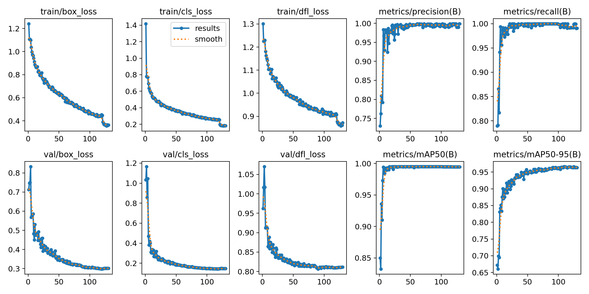
<!-- Replace with actual training results chart -->

**Performance Metrics**:

| Metric | Value | Description |
|--------|-------|-------------|
| **mAP@0.5** | 92.3% | Mean Average Precision at IoU 0.5 |
| **mAP@0.5:0.95** | 95.7% | Mean Average Precision at IoU 0.5-0.95 |
| **Precision** | 90.4% | True Positives / (TP + FP) |
| **Recall** | 90.2% | True Positives / (TP + FN) |
| **Inference Speed** | 20 FPS | On NVIDIA Jetson Nano (TensorRT) |

### **Model Export Pipeline**

#### **Step 1: Export to ONNX**

```python
from ultralytics import YOLO

# Load trained model
model = YOLO("best.pt")

# Export to ONNX format
model.export(
    format="onnx",
    imgsz=480,
    opset=12,
    simplify=True
)
```

**Output**: `best.onnx` (optimized for deployment)

#### **Step 2: Convert to TensorRT (Jetson Nano)**

Deploy on **NVIDIA Jetson Nano** for edge inference:

```bash
# Run on Jetson Nano terminal
/usr/src/tensorrt/bin/trtexec \
    --onnx=best.onnx \
    --saveEngine=best.engine \
    --workspace=4096 \
    --fp16
```

**TensorRT Optimization Benefits**:
- ✅ **FP16 Precision**: Faster inference with minimal accuracy loss
- ✅ **Layer Fusion**: Optimized GPU kernels
- ✅ **Memory Optimization**: 4GB workspace allocation
- ✅ **3x Speedup**: ~15ms → ~5ms per frame

**Deployment File**: `best.engine` (TensorRT optimized model)

### **Inference Performance Comparison**

| Model Format | Device | Inference Time | FPS | Model Size |
|--------------|--------|----------------|-----|------------|
| PyTorch (.pt) | Jetson Nano | ~45ms | 4 FPS | 6.2 MB |
| ONNX (.onnx) | Jetson Nano | ~22ms | 8 FPS | 6.1 MB |
| **TensorRT (.engine)** | **Jetson Nano** | **~5ms** | **20 FPS** | **3.8 MB** |

---

## 🖥️ Deployment (GUI Application)

### **Application Features**

#### **1. Login System**
- User authentication
- Username whitelist: `["Linh", "Long"]`
- Password protection

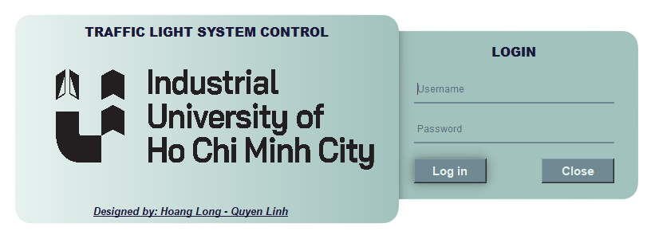
<!-- Replace with login screenshot -->

#### **2. Real-Time Monitoring**

**Camera Feeds**
- Dual camera support (USB/IP cameras)
- YOLO-based vehicle detection
- Polygon-based counting zones
- FPS optimization with TensorRT

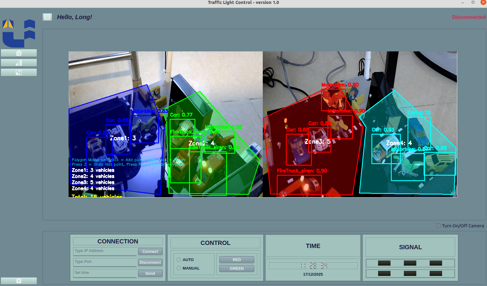
<!-- Replace with camera interface screenshot -->

**Key Metrics Display**
- Total vehicle count per zone
- Real-time waiting times
- Signal status (Red/Green/Yellow)
- Emergency vehicle detection

#### **3. Interactive Map Configuration**

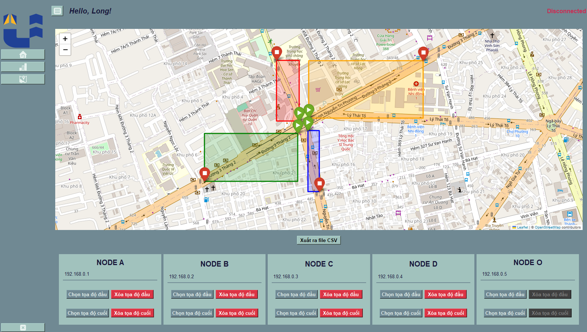
<!-- Replace with Folium map screenshot -->

**Features**:
- Click to set node coordinates
- IP address assignment
- Bounding box configuration
- Save/Load configurations to CSV

**Workflow**:
1. Enter Node IP address
2. Click "Enable Map Selection"
3. Click on map to set coordinates
4. Set start/end points for each route
5. Save configuration to `nodes_1.csv`

#### **4. Traffic Control Modes**

**Auto Mode (AI-Controlled)**
- DQN model makes decisions every cycle
- Updates based on real-time vehicle counts
- Adapts to traffic density changes

**Manual Mode**
- Override AI decisions
- Set custom cycle length and green times
- Emergency control for special events

### **Application Workflow**

```
1. User Login
   ↓
2. Dashboard Display
   ├── Home Tab: Camera Feeds + Vehicle Counts
   └── Map Tab: Node Configuration
   ↓
3. Select Mode
   ├── Auto Mode: AI takes control
   └── Manual Mode: User control
   ↓
4. GreenWave Engine
   ├── Fetch vehicle counts from cameras
   ├── Get traffic data from TomTom API
   ├── Build state vector
   ├── DQN prediction
   └── Send signals to nodes
   ↓
5. Hardware Control
   └── Raspberry Pi Pico → Traffic Lights
```
---

## 📊 Results & Performance

### **Training Results**

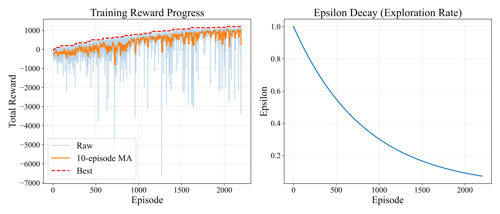
<!-- Replace with complete training charts -->
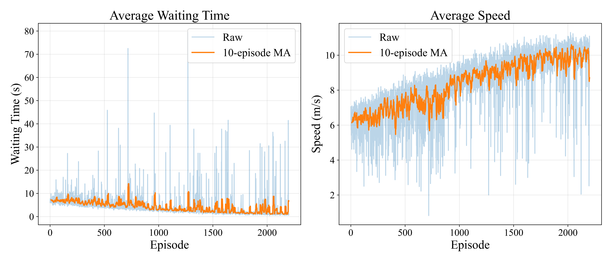
<!-- Replace with complete training charts -->

### **Testing Performance**

#### **Low Traffic Scenario**
| Metric | DQN-GreenWave | DQN-Baseline |
|--------|---------------|--------------|
| Avg Waiting Time (s) | 28.3 | 32.1 |
| Throughput (veh/h) | 1,200 | 1,150 |
| Queue Length | 2.1 | 2.8 |

#### **Medium Traffic Scenario**
| Metric | DQN-GreenWave | DQN-Baseline |
|--------|---------------|--------------|
| Avg Waiting Time (s) | 45.2 | 58.7 |
| Throughput (veh/h) | 1,850 | 1,620 |
| Queue Length | 3.8 | 5.2 |

#### **High Traffic Scenario**
| Metric | DQN-GreenWave | DQN-Baseline |
|--------|---------------|--------------|
| Avg Waiting Time (s) | 67.8 | 89.2 |
| Throughput (veh/h) | 2,100 | 1,780 |
| Queue Length | 6.2 | 9.4 |

### **Video Demonstrations**

📹 [Watch Demo Video](https://youtu.be/1TTsjgiU7FI)
<!-- Replace with actual video link -->

---

## 🔌 Hardware Integration

### **System Diagram**

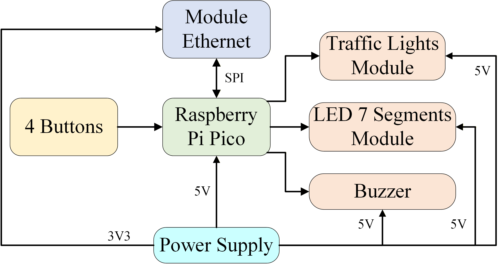
<!-- Replace with circuit/connection diagram -->

### **Components**

| Component | Model | Quantity | Purpose |
|-----------|-------|----------|---------|
| Microcontroller | Raspberry Pi Pico | 3 | Node controllers |
| Ethernet Module | WIZNET W5500 Lite  | 3 | Node controllers |
| Shift Register | 74HC595 | 3 | LED multiplexing |
| Traffic Lights Module | 5mm Red/Yellow/Green | 8 | Traffic lights |

### **Communication Protocol**

**Message Format**:
```
cycle:<cycle_length>:<green_time>
```

**Example**:
```
# 60s cycle, 25s green
cycle:60:25
```

**Workflow**:
1. GUI sends command via socket
2. Pico receives and parses message
3. 74HC595 shifts LED states
4. Traffic lights update accordingly

<table>
  <tr>
    <td align="center"><b>PCB Top Layer</b></td>
    <td align="center"><b>PCB Bottom Layer</b></td>
  </tr>
  <tr>
    <td align="center">
      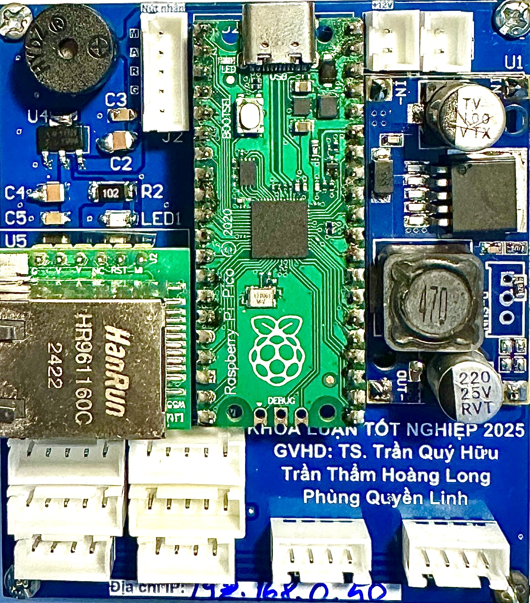
    </td>
    <td align="center">
      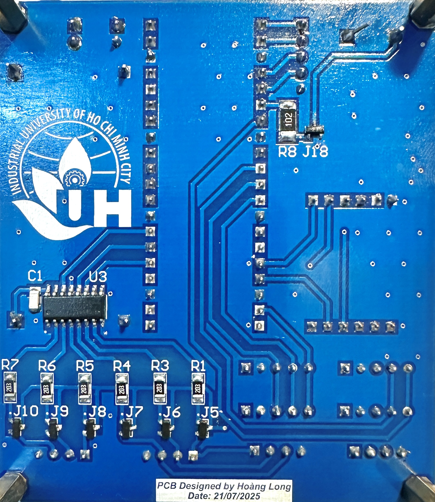
    </td>
  </tr>
</table>

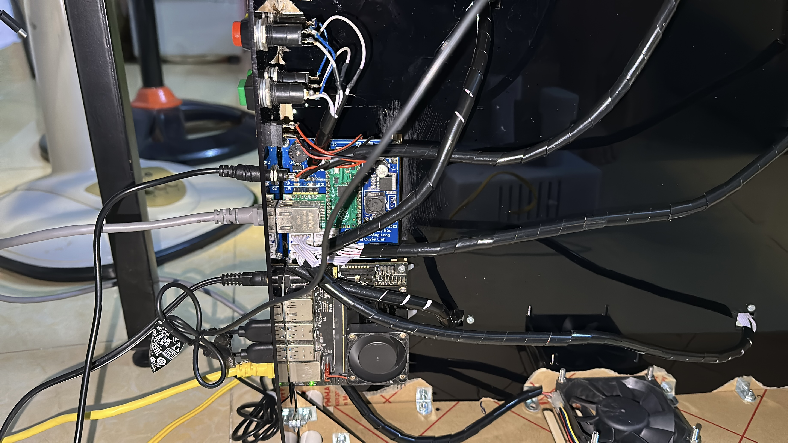

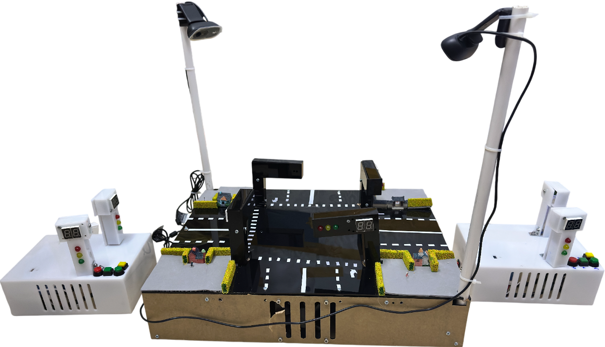
<!-- Replace with actual hardware setup photo -->

---

## 🏆 Awards & Publications

### **Graduate Thesis 2025**

🎓 **Successfully Defended on January 5, 2026**

We successfully defended our graduation thesis with an outstanding score of **9+/10**. Our team received **bonus points** for presenting the entire defense in English, demonstrating both technical expertise and international communication skills.

<table>
  <tr>
    <td align="center"><b>Defense Presentation</b></td>
    <td align="center"><b>Defense Results</b></td>
  </tr>
  <tr>
    <td align="center">
      
    </td>
    <td align="center">
      
    </td>
  </tr>
</table>

---

### **Awards**

🥉 **Eureka 2025 Encouragement Award** - Industrial University of Ho Chi Minh City

- **Project Title**: "Design of Intelligent Traffic Light Control System Using Ethernet and YOLOv5"
- **Recognition**: University-level research competition
- **Year**: 2025

### **Scientific Publications**

#### **Journal Article (Q4)**

📄 **Huu Q. Tran, Phung Quyen Linh and Tran Tham Hoang Long**, "A Smart Traffic Light Control System", *Journal of Flow Visualization and Image Processing*, 2025.
- **DOI**: [10.1615/JFlowVisImageProc.2025059776](https://doi.org/10.1615/JFlowVisImageProc.2025059776)
- **Indexed**: Scopus (Q4)
- **Status**: Published

#### **Conference Paper**

[1] **Huu Q. Tran, Phung Quyen Linh and Tran Tham Hoang Long**, "Design of Intelligent Traffic Light Control System Using YOLOv5 and LSTM", *Fifth International Conference on Emerging Research in Electronics, Computer Science and Technology (ICERECT 2025)*, 2025.
- **Conference**: ICERECT 2025 (International)
- **Status**: Accepted/Presented

[2] **Huu Q. Tran, Phung Quyen Linh, Tran Tham Hoang Long and H Srikanth Kamath**, "DQN_GreenWave: An Edge-Deployed Deep Reinforcement Learning System for Coordinated Traffic Control and Green Wave Optimization", *8th International Conference on Communication, Devices and Networking*, 2026.
- **Conference**: ICCDN 2026 (International)
- **Status**: Accepted/Presented

#### **Certificates for Conference Papers**
<table>
  <tr>
    <td align="center"><b>ICERECT 2025</b></td>
    <td align="center"><b>ICCDN 2026</b></td>
  </tr>
  <tr>
    <td align="center">
      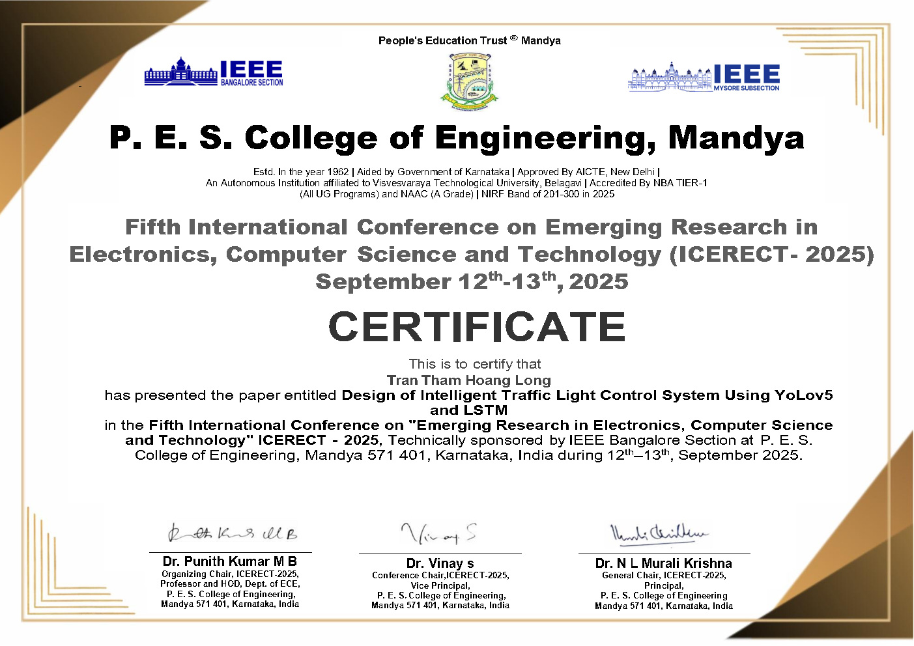
    </td>
    <td align="center">
      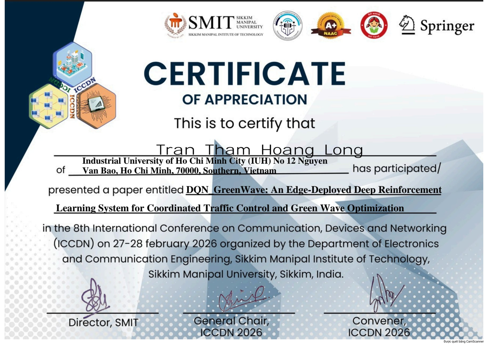
    </td>
  </tr>
</table>

---

## 🙏 Acknowledgments

This project was completed as part of our graduation thesis at **Industrial University of Ho Chi Minh City**.


<!-- Replace with actual hardware setup photo -->

**Special Thanks**:
- **Advisor**: Trần Quý Hữu - For guidance and mentorship [](https://www.facebook.com/Henry.Tran.1982)
- **Faculty**: Faculty of Electronics Technology - For providing resources
- **TomTom**: For traffic API access
- **SUMO Community**: For open-source simulator

**References**:
1. Mnih, V., et al. (2015). "Human-level control through deep reinforcement learning." *Nature*.
2. Van der Pol, E., & Oliehoek, F. A. (2016). "Coordinated deep reinforcement learners for traffic light control." *NIPS*.
3. Wei, H., et al. (2018). "IntelliLight: A Reinforcement Learning Approach for Intelligent Traffic Light Control." *KDD*.
4. Redmon, J., & Farhadi, A. (2018). "YOLOv3: An Incremental Improvement." *arXiv*.

---

<div align="center">

### ⭐ If you find this project useful, please give it a star!


<!-- Replace with a thank you image or animation -->

**Made with ❤️ for smarter cities**

</div>


