# 🚦 Hệ Thống Điều Khiển Đèn Giao Thông Thông Minh Sử Dụng Học Tăng Cường Sâu

**Language / Ngôn ngữ:** [English](README.md) | [Tiếng Việt](README_vietnamese.md)

[](https://www.python.org/downloads/)
[](https://pytorch.org/)
[](https://www.eclipse.org/sumo/)

> Hệ thống quản lý giao thông được hỗ trợ bởi AI, tối ưu hóa thời gian đèn tín hiệu đa giao lộ sử dụng Deep Q-Network (DQN) và phát hiện phương tiện thời gian thực.

---

## 👥 Thành Viên Thực Hiện

| Tên | Vai Trò | Liên Hệ | Email |
|------|------|---------|---------|
| **Trần Thẩm Hoàng Long** | Phát triển DQN, Thiết kế & Phát triển GUI, Nhận diện Đối tượng, Triển khai Edge AI, Thiết kế PCB, Lập trình Firmware | [](https://www.facebook.com/hoanglong111203) | tranthamhoanglong01@gmail.com |
| **Phùng Quyền Linh** | Phát triển Thuật toán Green Wave, Phát triển GUI, Tích hợp Phần cứng, Lập trình Firmware | [](https://www.facebook.com/phung.quyen.linh.2024) | quyenlinh06677@gmail.com |

---

## 📋 Mục Lục

- [Tổng Quan](#-tổng-quan)
- [Tính Năng Chính](#-tính-năng-chính)
- [Kiến Trúc Hệ Thống](#-kiến-trúc-hệ-thống)
- [Công Nghệ Sử Dụng](#-công-nghệ-sử-dụng)
- [So Sánh Các Phương Pháp DQN](#-so-sánh-các-phương-pháp-dqn)
- [Cấu Trúc Dự Án](#-cấu-trúc-dự-án)
- [Cài Đặt & Thiết Lập](#-cài-đặt--thiết-lập)
- [Giai Đoạn Huấn Luyện (SUMO)](#-giai-đoạn-huấn-luyện-sumo)
- [Triển Khai (Ứng Dụng GUI)](#-triển-khai-ứng-dụng-gui)
- [Kết Quả & Hiệu Suất](#-kết-quả--hiệu-suất)
- [Tích Hợp Phần Cứng](#-tích-hợp-phần-cứng)
- [Thành Viên](#-thành-viên)

---

## 🎯 Tổng Quan

### **Vấn Đề Đặt Ra**
Đèn giao thông cố định truyền thống không thể thích ứng với điều kiện giao thông động, dẫn đến:
- Thời gian chờ dài trong giờ cao điểm
- Phối hợp kém giữa các giao lộ liền kề
- Sóng xanh kém hiệu quả

### **Giải Pháp Của Chúng Tôi**
Hệ thống điều khiển giao thông thích ứng dựa trên DQN có khả năng:
- **Học** các chính sách thời gian tín hiệu tối ưu thông qua mô phỏng
- **Thích ứng** với điều kiện giao thông thời gian thực bằng phát hiện phương tiện qua camera
- **Phối hợp** nhiều giao lộ để tạo sóng xanh mượt mà
- **Triển khai** trên GUI thực tế với tích hợp phần cứng


<!-- Replace with system architecture diagram -->

---

## ✨ Tính Năng Chính

- 🤖 **Tối Ưu Hóa AI**: Multi-head DQN cho thời gian tín hiệu động
- 🌊 **Phối Hợp Sóng Xanh**: Dòng giao thông đồng bộ qua các giao lộ
- 📹 **Phát Hiện Thời Gian Thực**: Đếm phương tiện dựa trên YOLO với tăng tốc TensorRT
- 🗺️ **Bản Đồ Tương Tác**: Cấu hình và trực quan hóa node dựa trên Folium
- 🌐 **Dữ Liệu Giao Thông Trực Tiếp**: Tích hợp TomTom API cho tốc độ và phát hiện sự cố
- 🎛️ **Điều Khiển Thủ Công**: Chuyển đổi chế độ Tự động/Thủ công cho điều khiển khẩn cấp
- 🔌 **Tích Hợp Phần Cứng**: Raspberry Pi Pico cho điều khiển tín hiệu vật lý
- 📊 **Bảng Điều Khiển Hiệu Suất**: Số liệu thời gian thực và trực quan hóa dữ liệu lịch sử

---

## 🏗️ Kiến Trúc Hệ Thống

### **Quy Trình**

```
1. Huấn Luyện Mô Phỏng SUMO
   ├── Thiết lập Mạng Giao Thông
   ├── Huấn luyện DQN Agent (So sánh DQN-GreenWave và DQN-Baseline)
   ├── Đánh giá & Lựa chọn Model
   └── Xuất Model Tốt Nhất (.pth)

2. Triển Khai GUI
   ├── Nạp Model Đã Huấn Luyện
   ├── Đầu Vào Camera Thời Gian Thực (YOLO Detection)
   ├── TomTom API (Tốc độ & Sự cố)
   ├── GreenWave Engine (Tối ưu Tín hiệu)
   └── Điều Khiển Phần Cứng (Raspberry Pi Pico)
```

### **Các Thành Phần Hệ Thống**

| Thành Phần | Công Nghệ | Mục Đích |
|-----------|-----------|---------|
| **Mô Phỏng** | SUMO + TraCI | Huấn luyện và kiểm tra DQN agents |
| **Mô Hình AI** | PyTorch DQN | Tối ưu hóa thời gian tín hiệu |
| **Nhận Diện Đối Tượng** | YOLOv8n + TensorRT | Đếm phương tiện |
| **GUI** | PyQt5 | Giao diện người dùng và điều khiển |
| **Trực Quan Hóa Bản Đồ** | Folium | Cấu hình node tương tác |
| **API Giao Thông** | TomTom | Dữ liệu tốc độ thời gian thực |
| **Phần Cứng** | Raspberry Pi Pico + 74HC595 | Điều khiển tín hiệu vật lý |

---

## 💻 Công Nghệ Sử Dụng

### **Deep Learning & AI**
- **PyTorch 2.0+**: Framework mạng nơ-ron
- **DQN (Deep Q-Network)**: Thuật toán học tăng cường
- **Experience Replay**: Huấn luyện ổn định
- **Target Network**: Giảm overestimation

### **Computer Vision**
- **YOLOv8n**: Nhận diện đối tượng thời gian thực
- **TensorRT**: Tăng tốc GPU cho suy luận
- **OpenCV**: Xử lý ảnh

### **Mô Phỏng Giao Thông**
- **SUMO (Simulation of Urban MObility)**: Trình mô phỏng giao thông
- **TraCI**: Giao diện Python cho điều khiển SUMO
- **randomTrips.py**: Tạo mẫu giao thông

### **GUI & Trực Quan Hóa**
- **PyQt5**: Framework ứng dụng desktop
- **Folium**: Bản đồ tương tác
- **QWebEngineView**: Trình duyệt web nhúng

### **APIs & Networking**
- **TomTom Traffic API**: Dữ liệu giao thông thời gian thực
- **Socket Programming**: Giao tiếp đa node
- **Threading**: Xử lý đồng thời

### **Phần Cứng**
- **Raspberry Pi Pico**: Vi điều khiển (W5500 Ethernet)
- **74HC595 Shift Register**: Điều khiển LED tín hiệu
- **MicroPython**: Lập trình nhúng

---

## 🔬 So Sánh Các Phương Pháp DQN

Chúng tôi đã phát triển và so sánh **hai phương pháp dựa trên DQN** để xác định chiến lược tối ưu cho điều khiển đèn giao thông:

### **1. DQN-GreenWave (Phương Pháp Sóng Xanh)** ⭐ *Khuyến Nghị*

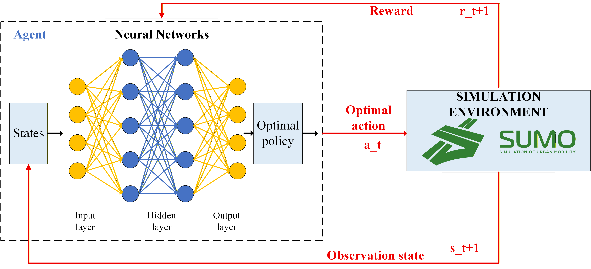
<!-- Replace with DQN-GreenWave architecture diagram -->

#### **Không Gian Trạng Thái** (9 chiều)
- **Thời Gian Di Chuyển** (4): T_AO, T_OB, T_CO, T_OD (chuẩn hóa theo 60s)
- **Số Lượng Phương Tiện** (4): z1, z2, z3, z4 (chuẩn hóa theo 50 xe)
- **Mật Độ Giao Thông** (1): 0.0 (thấp) / 0.5 (trung bình) / 1.0 (cao)

#### **Không Gian Hành Động** (Multi-Head Output)
- **Độ Dài Chu Kỳ**: 9 lựa chọn (20, 30, 40, 50, 60, 70, 80, 90, 100 giây)
- **Thời Gian Xanh AB**: 8 lựa chọn (5, 10, 15, 20, 25, 30, 35, 40 giây)
- **Hướng AOB**: 2 lựa chọn (AtoB, BtoA)
- **Hướng COD**: 2 lựa chọn (CtoD, DtoC)

#### **Hàm Phần Thưởng**
```python
reward = α × (green_wave_bonus) + β × (throughput) - γ × (waiting_time) - δ × (queue_length)
```
- Nhấn mạnh **phối hợp** giữa các giao lộ
- Khen thưởng dòng giao thông mượt mà

#### **Kiến Trúc Mạng**
- **Lớp Đầu Vào**: 9 neurons (vector trạng thái)
- **Lớp Ẩn**: [128, 128, 64] với ReLU + Dropout (0.2)
- **Đầu Ra Multi-Head**: 4 head riêng biệt (multi-task learning)
  - head_cycle: 9 outputs
  - head_green: 8 outputs
  - head_dir_aob: 2 outputs
  - head_dir_cod: 2 outputs

---

### **2. DQN-Baseline (Phương Pháp Cơ Bản)**

#### **Khác Biệt So Với DQN-GreenWave**
- Biểu diễn trạng thái đơn giản hơn (không tập trung vào thời gian di chuyển)
- Không gian hành động đầu ra đơn (hành động rời rạc kết hợp)
- Phần thưởng tập trung vào **tối ưu hóa giao lộ riêng lẻ**
- Không có phối hợp sóng xanh rõ ràng

#### **Trường Hợp Sử Dụng**
- Làm baseline thực nghiệm để so sánh hiệu suất
- Phù hợp cho các giao lộ biệt lập không cần phối hợp

---

### **📊 So Sánh Hiệu Suất**

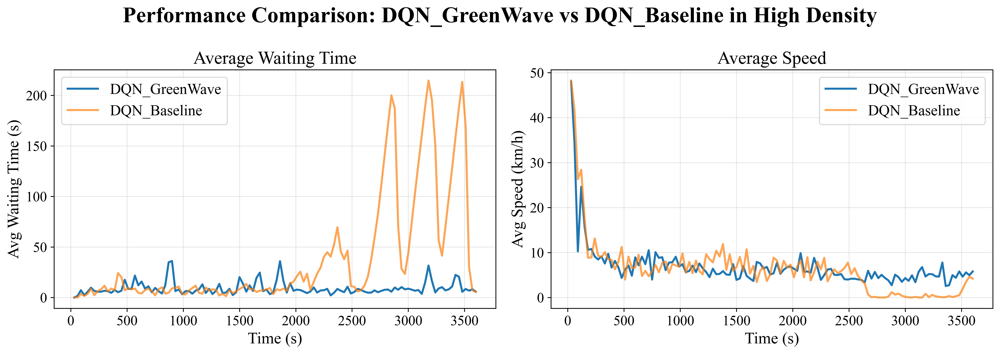
<!-- Replace with comparison bar chart from test results -->

| Chỉ Số | DQN-GreenWave | DQN-Baseline | Cải Thiện |
|--------|---------------|--------------|-------------|
| **Thời Gian Chờ Trung Bình (s)** | 21.28 | 14.07 | ✅ **-33.9%** |
| **Tốc Độ Trung Bình (m/s)** | 2.87 | 2.36 | ✅ **+17.6%** |
| **Hiệu Suất Sóng Xanh** | 82.5% | 64.3% | ✅ **+18.2%** |

#### **Kịch Bản Kiểm Tra**
- ✅ **Giao Thông Thấp**: Cả hai hoạt động tốt, GreenWave tốt hơn một chút
- ✅ **Giao Thông Trung Bình**: GreenWave cho thấy lợi thế rõ ràng
- ✅ **Giao Thông Cao**: GreenWave vượt trội đáng kể so với baseline

---

## 🌊 Thuật Toán Điều Khiển Sóng Xanh

**Green Wave Controller** là động cơ phối hợp cốt lõi chuyển đổi đầu ra DQN thành lệnh tín hiệu SUMO TraCI. Nó triển khai cơ chế **BÙ/GỘP (Compensation/Consolidation)** tinh vi để đồng bộ tín hiệu động qua 5 giao lộ.

### **Cấu Trúc Hệ Thống**

```
          node_A ←────→ node_O ←────→ node_B
                          ↑
                          │
                          ↓
          node_C ←────→ node_O ←────→ node_D
```

**Cụm Node**:
- **Cụm AOB**: `node_A`, `node_O`, `node_B` (Trục chính)
- **Cụm COD**: `node_C`, `node_O`, `node_D` (Trục phụ)
- **Trung Tâm**: `node_O` phối hợp cả hai cụm

### **Các Tham Số Chính**

| Tham Số | Ký Hiệu | Mô Tả | Phạm Vi |
|-----------|--------|-------------|-------|
| **Độ Dài Chu Kỳ** | $C$ | Tổng thời gian chu kỳ tín hiệu | 20-100s |
| **Thời Gian Xanh AOB** | $G_{AB}$ | Thời lượng xanh cho cụm AOB | 5-40s |
| **Thời Gian Xanh COD** | $G_{CD}$ | Thời lượng xanh cho cụm COD | $C - G_{AB} - Y$ |
| **Thời Gian Vàng** | $Y$ | Khoảng thời gian chuyển đổi | 3s (cố định) |
| **Thời Gian Di Chuyển** | $T_{AO}, T_{OB}, T_{CO}, T_{OD}$ | Thời gian di chuyển giữa các node | Động |
| **Offset** | $\Delta_{AB}, \Delta_{CD}$ | Độ lệch pha | Mỗi 2s |

### **Các Pha Thuật Toán**

Bộ điều khiển hoạt động trong **hai pha riêng biệt**:

#### **1. Pha SYNC (Chế Độ Đồng Bộ)**

**Mục Đích**: Căn chỉnh lại các node khi độ lệch thời gian vượt ngưỡng

**Điều Kiện Kích Hoạt**:

$$
\max_{n \in \text{nodes}} \left| C - \left| T^{\text{pred}}_n(t) - T^{\text{old}}_n(t-1) \right| \right| > \theta_{\text{sync}}
$$

Trong đó:
- $T^{\text{pred}}_n(t)$: Thời gian bắt đầu xanh dự đoán cho node $n$ tại chu kỳ $t$
- $T^{\text{old}}_n(t-1)$: Thời gian dự đoán trước đó từ chu kỳ $t-1$
- $\theta_{\text{sync}}$: Ngưỡng đồng bộ thích ứng (cơ sở = 5s)

**Ngưỡng Thích Ứng**:

$$
\theta_{\text{sync}} = \theta_{\text{base}} \times \alpha_{\text{density}} \times \beta_{\text{transition}}
$$

- $\alpha_{\text{density}}$: Hệ số mật độ giao thông
  - Thấp: 0.8, Trung bình: 1.0, Cao: 1.3
- $\beta_{\text{transition}}$: Hệ số phạt chuyển đổi mượt
  - Sau SYNC→NORMAL: 1.2 (ngăn dao động)
  - Mặc định: 1.0

**Cơ Chế BÙ/GỘP**:

Với mỗi node, tính độ lệch thời gian:

$$
\Delta_n = T^{\text{pred}}_n - T^{\text{leader}}
$$

Phân tách thành bội số chu kỳ và phần dư:

$$
\Delta_n = n \cdot C + m, \quad \text{trong đó } n = \left\lfloor \frac{\Delta_n}{C} \right\rfloor, \quad m = \Delta_n \mod C
$$

**Logic Quyết Định**:

$$
\begin{cases}
\text{BÙ (Chu Kỳ Ngắn)}: & \text{nếu } m > \theta_{\Delta} \\
\quad C_{\text{send}} = m & \\
\quad G_{\text{send}} = G_{\text{base}} \times \frac{m}{C} & \\
\\
\text{GỘP (Chu Kỳ Dài)}: & \text{nếu } m \leq \theta_{\Delta} \\
\quad C_{\text{send}} = C + m & \\
\quad G_{\text{send}} = G_{\text{base}} \times \frac{C + m}{C} &
\end{cases}
$$

Trong đó:
- $\theta_{\Delta}$: Ngưỡng BÙ/GỘP = $\frac{C}{2} + 1$ (điều chỉnh động dựa trên mật độ giao thông)
- $G_{\text{base}}$: Thời gian xanh cơ sở ($G_{AB}$ hoặc $G_{CD}$ tùy cụm)
- Ràng buộc an toàn: $G_{\text{send}} \geq 5s$ (xanh tối thiểu)

**Giải Thích Vật Lý**:
- **BÙ (Compensation)**: Sử dụng **chu kỳ rút ngắn** để "bắt kịp" khi chậm hơn leader
- **GỘP (Consolidation)**: Sử dụng **chu kỳ kéo dài** để "chờ" và đồng bộ với làn sóng tiếp theo

#### **2. Pha NORMAL (Chế Độ Ổn Định)**

**Mục Đích**: Duy trì hoạt động đồng bộ với chu kỳ đồng nhất

**Điều Kiện Kích Hoạt**:

$$
\max_{n \in \text{nodes}} \left| C - \left| T^{\text{pred}}_n(t) - T^{\text{old}}_n(t-1) \right| \right| \leq \theta_{\text{sync}}
$$

**Hoạt Động**:

Tất cả các node chạy chu kỳ giống nhau:

$$
C_{\text{send}} = C, \quad G_{\text{send}} = \begin{cases}
G_{AB} & \text{cho cụm AOB} \\
G_{CD} & \text{cho cụm COD}
\end{cases}
$$

**Quản Lý SYNC Thông Minh**:
1. **Cơ Chế Cooldown**: Sau pha SYNC, ép buộc 1-2 chu kỳ NORMAL để ngăn dao động nhanh
2. **Giới Hạn SYNC Liên Tiếp**: Ở mật độ cao, giới hạn 3 SYNC liên tiếp (ngăn bất ổn)
3. **Ngưỡng Tăng Dần**: Tăng $\theta_{\text{sync}}$ theo số lượng SYNC liên tiếp:

$$
\theta_{\text{progressive}} = \theta_{\text{sync}} \times (1.0 + 0.3 \times N_{\text{consecutive}})
$$

### **Tính Toán Thời Gian Dự Đoán**

Bộ điều khiển dự đoán thời gian bắt đầu xanh cho tất cả các node dựa trên hướng dòng giao thông và thời gian di chuyển.

#### **Cụm AOB (Trục Chính)**

**Hướng: A → O → B**

$$
\begin{aligned}
T_A^{\text{pred}} &= t_{\text{now}} \\
T_O^{\text{pred}} &= T_A^{\text{pred}} + T_{AO} + \Delta_{CD} \\
T_B^{\text{pred}} &= T_A^{\text{pred}} + T_{AO} + T_{OB} + \Delta_{CD}
\end{aligned}
$$

**Hướng: B → O → A**

$$
\begin{aligned}
T_B^{\text{pred}} &= t_{\text{now}} \\
T_O^{\text{pred}} &= T_B^{\text{pred}} + T_{OB} + \Delta_{CD} \\
T_A^{\text{pred}} &= T_B^{\text{pred}} + T_{OB} + T_{AO} + \Delta_{CD}
\end{aligned}
$$

#### **Cụm COD (Trục Phụ)**

Cụm COD bắt đầu **sau khi cụm AOB kết thúc** với độ lệch pha:

$$
T_{O(\text{CD})}^{\text{pred}} = T_O^{\text{pred}} + G_{AB} + Y + \Delta_{AB}
$$

**Hướng: C → O → D**

$$
\begin{aligned}
T_C^{\text{pred}} &= \max\left(T_{O(\text{CD})}^{\text{pred}} - T_{CO} + \Delta_{AB}, \, t_{\text{now}}\right) \\
T_D^{\text{pred}} &= T_{O(\text{CD})}^{\text{pred}} + T_{OD} + \Delta_{AB}
\end{aligned}
$$

**Hướng: D → O → C**

$$
\begin{aligned}
T_D^{\text{pred}} &= \max\left(T_{O(\text{CD})}^{\text{pred}} - T_{OD} - \Delta_{AB}, \, t_{\text{now}}\right) \\
T_C^{\text{pred}} &= T_{O(\text{CD})}^{\text{pred}} + T_{CO} + \Delta_{AB}
\end{aligned}
$$

**Ràng Buộc**: Thời gian dự đoán không được nằm trong quá khứ:

$$
T_n^{\text{pred}} \geq t_{\text{now}}, \quad \forall n \in \{\mathrm{node\_C}, \mathrm{node\_D}\}
$$

### **Tạo Chương Trình Đèn Tín Hiệu**

Với mỗi node, bộ điều khiển tạo **chương trình tín hiệu 4 pha**:

| Pha | Thời Lượng | Mẫu Trạng Thái | Mô Tả |
|-------|----------|---------------|-------------|
| **P0** | $G_{\text{send}}$ | `GGGGrrrrGGGGrrrr` | Hướng chính xanh |
| **P1** | $Y$ (3s) | `yyyyrrrryyyyrrrr` | Chuyển đổi hướng chính (vàng) |
| **P2** | $C_{\text{send}} - G_{\text{send}} - Y$ | `rrrrGGGGrrrrGGGG` | Hướng phụ xanh |
| **P3** | $Y$ (3s) | `rrrryyyyrrrryyyy` | Chuyển đổi hướng phụ (vàng) |

**Triển Khai SUMO TraCI**:
```python
phases = [
    traci.trafficlight.Phase(int(round(green_time)), state_p0),
    traci.trafficlight.Phase(int(round(yellow)), state_p1),
    traci.trafficlight.Phase(int(round(green_cd)), state_p2),
    traci.trafficlight.Phase(int(round(yellow)), state_p3),
]

logic = traci.trafficlight.Logic("dqn_greenwave", 0, 0, phases)
traci.trafficlight.setProgramLogic(tl_id, logic)
```

### **Chiến Lược Tối Ưu Hóa**

#### **1. Quản Lý SYNC Thông Minh**
- **Bộ Đếm SYNC Liên Tiếp**: Theo dõi các pha SYNC liên tiếp

$$
N_{\text{consecutive}} = \begin{cases}
N_{\text{consecutive}} + 1 & \text{nếu pha SYNC} \\
0 & \text{nếu pha NORMAL}
\end{cases}
$$
- **Ép Buộc Pha NORMAL**: Nếu $N_{\text{consecutive}} \geq 3$ ở mật độ cao, ép NORMAL trong 2 chu kỳ

#### **2. Bộ Nhớ Đệm Thời Gian Di Chuyển**
- Cache tính toán thời gian di chuyển để giảm số lần gọi API
- Chỉ cập nhật khi phát hiện thay đổi đáng kể (> 10% độ lệch)

#### **3. Theo Dõi Chuyển Đổi Mượt**
- Theo dõi loại pha cuối cùng (SYNC/NORMAL)
- Áp dụng hệ số phạt chuyển đổi ($\beta_{\text{transition}} = 1.2$) để ngăn chuyển đổi chế độ nhanh

### **Đặc Điểm Hiệu Suất**

**Điểm Mạnh**:
- ✅ **Thích Ứng Động**: Phản ứng với mẫu giao thông thay đổi theo thời gian thực
- ✅ **Ổn Định**: Quản lý SYNC thông minh ngăn dao động
- ✅ **Phối Hợp**: Duy trì tiến trình sóng xanh qua 5 node
- ✅ **Bền Vững**: Ngưỡng thích ứng xử lý các mức mật độ khác nhau

**Đánh Đổi**:
- ⚖️ **Chi Phí SYNC**: SYNC thường xuyên có thể tăng thời gian chuyển đổi
- ⚖️ **Chi Phí Tính Toán**: Tính toán thời gian dự đoán mỗi chu kỳ
- ⚖️ **Độ Nhạy Tham Số**: Điều chỉnh ngưỡng ảnh hưởng đến hiệu suất

**Độ Phức Tạp**:
- Độ Phức Tạp Thời Gian: $O(N)$ mỗi chu kỳ, với $N$ = số node (5)
- Độ Phức Tạp Không Gian: $O(N)$ cho theo dõi trạng thái

---

## 📁 Cấu Trúc Dự Án

```
📦 KLTN/
├── 📂 SUMO/                          # Môi Trường Mô Phỏng
│   ├── 📂 Five_Intersections/
│   │   ├── 📂 DQN_GreenRGG/         # Phương Pháp Green Wave (Production)
│   │   │   ├── dqn_greenrgg_agent.py
│   │   │   ├── dqn_greenrgg_config.py
│   │   │   ├── dqn_greenrgg_environment.py
│   │   │   ├── dqn_greenrgg_train.py
│   │   │   ├── dqn_greenrgg_test.py
│   │   │   ├── green_wave_controller.py
│   │   │   ├── traffic_generator.py
│   │   │   ├── 📂 models/
│   │   │   │   ├── best_green.pth      # ⭐ Model tốt nhất cho GUI
│   │   │   ├── 📂 test_results/
│   │   │   │   ├── dqn_greenrgg_low.csv
│   │   │   │   ├── dqn_greenrgg_medium.csv
│   │   │   │   └── dqn_greenrgg_high.csv
│   │   │   └── 📂 training_logs/
│   │   │       ├── rewards.csv
│   │   │       ├── losses.csv
│   │   │       └── metrics.csv
│   │   │
│   │   ├── 📂 DQN_Dump/              # Phương Pháp Baseline
│   │   │   ├── dqn_dump_agent.py
│   │   │   ├── dqn_dump_config.py
│   │   │   ├── dqn_dump_environment.py
│   │   │   ├── dqn_dump_train.py
│   │   │   ├── dqn_dump_test.py
│   │   │   ├── traffic_generator.py
│   │   │   ├── 📂 models/
│   │   │   ├── 📂 test_results/
│   │   │   └── 📂 training_logs/
│   │   │
│   │   └── 📂 MapFiles/              # File Mạng SUMO
│   │       ├── *.net.xml
│   │       ├── *.rou.xml
│   │       └── *.sumocfg
│   │
│   └── randomTrips.py                # Tạo Mẫu Giao Thông
│
├── 📂 Code/
│   └── 📂 GUI/
│       └── 📂 Ver3/                  # Ứng Dụng GUI Production
│           ├── runLogin_Main.py      # 🚀 Điểm Vào Chính
│           ├── login_UI.py           # Giao Diện Đăng Nhập
│           ├── login_func.py         # Logic Đăng Nhập
│           ├── main_UI.py            # Giao Diện Chính
│           ├── main_func_testing4.py # Logic Chính
│           │
│           ├── 📂 DQN Integration/
│           │   ├── dqn_model.py              # Định Nghĩa Mạng Nơ-ron
│           │   ├── dqn_decision_maker.py     # Công Cụ Suy Luận
│           │   └── greenwave_engine.py       # Công Cụ Phối Hợp Giao Thông
│           │
│           ├── 📂 Models/
│           │   ├── best_green.pth            # Model DQN Đã Huấn Luyện
│           │   └── best.engine               # Đã Huấn Luyện và xuất sang TensorRT
│           │
│           ├── 📂 Configuration/
│           │   ├── nodes.csv                 # IP/Tọa độ Node
│           │   └── res.qrc                   # Tài Nguyên Qt
│           │
│           ├── 📂 ui_file/           # File PyQt UI
│           ├── 📂 icon/              # Icon & Hình Ảnh
│
└── 📂 hardware/                      # Tích Hợp IoT
    ├── pico_74hc595_final5.py       # Code Raspberry Pi Pico
    └── W5500_EVB_PICO-*.uf2         # Firmware MicroPython
```

---

## 🎓 Giai Đoạn Huấn Luyện (SUMO)

### **Thiết Lập Môi Trường**

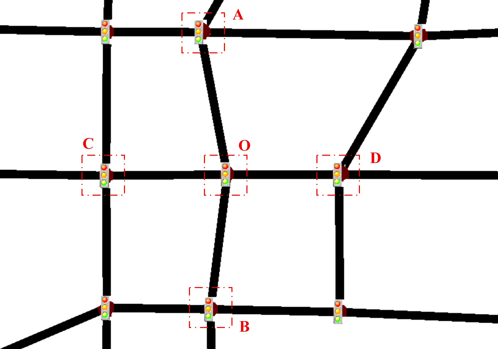
<!-- Replace with SUMO network screenshot -->

Môi trường mô phỏng bao gồm **5 giao lộ** với mẫu giao thông thực tế:
- **Node A, B, C, D**: Giao lộ ngoại vi
- **Node O**: Node điều khiển trung tâm (phối hợp tất cả tín hiệu)


#### **Siêu Tham Số**

| Tham Số | Giá Trị | Mô Tả |
|-----------|-------|-------------|
| Tốc Độ Học (Learning Rate) | 0.0005 | Bộ tối ưu Adam |
| Kích Thước Batch (Batch Size) | 64 | Lấy mẫu bộ đệm replay |
| Gamma (γ) | 0.99 | Hệ số chiết khấu |
| Epsilon Bắt Đầu | 1.0 | Tỷ lệ khám phá |
| Epsilon Kết Thúc | 0.01 | Khám phá tối thiểu |
| Epsilon Suy Giảm | 0.995 | Suy giảm mỗi episode |
| Bộ Đệm Replay | 100,000 | Dung lượng kinh nghiệm |
| Cập Nhật Target | Mỗi 10 episodes | Đồng bộ mạng |
| Episodes | 2,200 | Tổng số episodes huấn luyện |

### **Lựa Chọn Model Tốt Nhất**

Model có **thời gian chờ trung bình thấp nhất** qua tất cả kịch bản được chọn:
```
✅ best_green.pth → Triển khai lên GUI
```

---

## 🖥️ Huấn Luyện Nhận Diện Đối Tượng (YOLOv8)

### **Chuẩn Bị Dataset**

Dataset tùy chỉnh của chúng tôi tập trung vào **4 lớp phương tiện** cho điều kiện giao thông Việt Nam:

| Ô tô | Xe máy | Xe Cứu Hỏa Bình Thường | Xe Cứu Hỏa Khẩn Cấp |
|:---:|:----------:|:---:|:-----:|
|  | 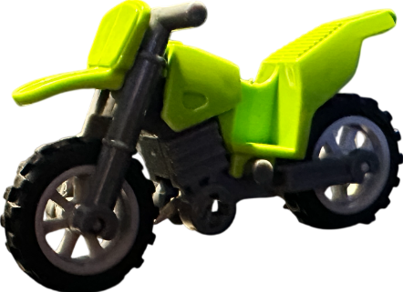 | 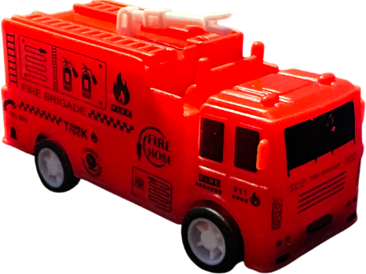 | 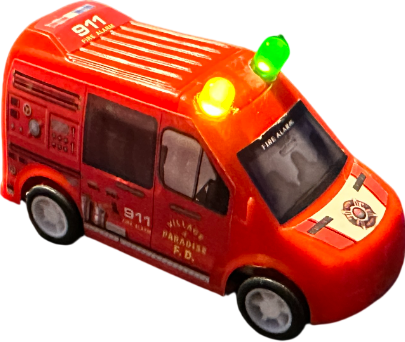 |
<!-- Replace with actual vehicle class images from your dataset -->

**Nguồn Dataset của chúng tôi**: [Roboflow - Toy Vehicle Detection](https://universe.roboflow.com/camera-giao-thng/toy-vehicle-detection-jwxdt)

**Thống Kê Dataset**:
- **Tổng Hình Ảnh**: ~2,000+ ảnh được gán nhãn
- **Lớp**: 4 (Ô tô, Xe máy, Xe Cứu Hỏa Bình Thường, Xe Cứu Hỏa Khẩn Cấp)
- **Phân Chia**: 70% Train / 20% Validation / 10% Test
- **Định Dạng Chú Thích**: Định dạng YOLO (file txt)
- **Augmentations**: Lật, Xoay, Độ Sáng, Độ Tương Phản

### **Huấn Luyện Trên Kaggle**

Chúng tôi tận dụng **tài nguyên GPU miễn phí của Kaggle** để huấn luyện YOLOv8:

**Notebook Huấn Luyện của chúng tôi**: [YOLOv8 Training on Kaggle](https://www.kaggle.com/code/dustinnguyn/yolov8-training)

**Cấu Hình Huấn Luyện**:
```python
from ultralytics import YOLO

model = YOLO("yolov8s.pt")

results = model.train(
    data="/kaggle/input/testing/dataset_final4/data.yaml",
    epochs=130,
    imgsz=416,
    batch=64,
    device=[0,1],
    workers=8,

    optimizer="AdamW",
    lr0=0.001,
    weight_decay=0.0005,
    warmup_epochs=3,
    cos_lr=True,

    freeze=10,
    label_smoothing=0.05,
    close_mosaic=10,
    multi_scale=True,   # RẤT QUAN TRỌNG trong case này

    amp=True,
    cache=False,
    plots=True,
    augment=True,

    project="/kaggle/working/runs/detect",
    name="yolov8s_ms416"
)
```

**Phần Cứng**: 2x Kaggle T4 GPU

### **Kết Quả Huấn Luyện**

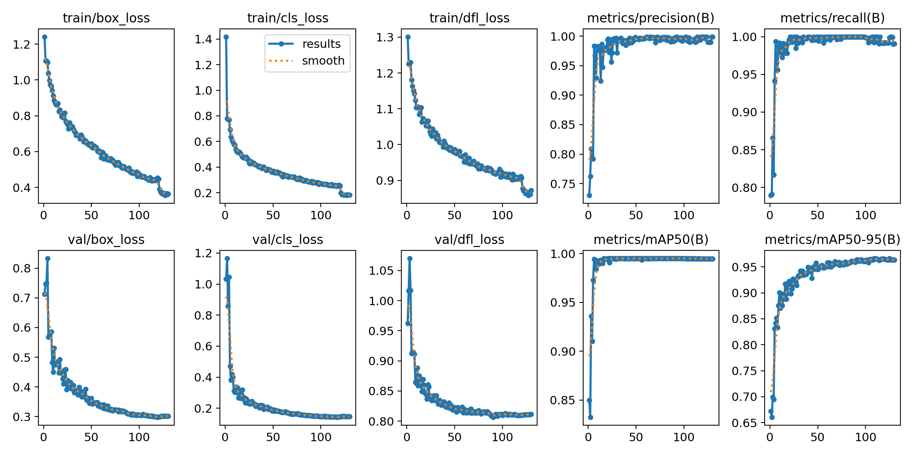
<!-- Replace with actual training results chart -->

**Chỉ Số Hiệu Suất**:

| Chỉ Số | Giá Trị | Mô Tả |
|--------|-------|-------------|
| **mAP@0.5** | 92.3% | Mean Average Precision tại IoU 0.5 |
| **mAP@0.5:0.95** | 95.7% | Mean Average Precision tại IoU 0.5-0.95 |
| **Precision** | 90.4% | True Positives / (TP + FP) |
| **Recall** | 90.2% | True Positives / (TP + FN) |
| **Tốc Độ Suy Luận** | 20 FPS | Trên NVIDIA Jetson Nano (TensorRT) |

### **Quy Trình Xuất Model**

#### **Bước 1: Xuất sang ONNX**

```python
from ultralytics import YOLO

# Nạp model đã huấn luyện
model = YOLO("best.pt")

# Xuất sang định dạng ONNX
model.export(
    format="onnx",
    imgsz=480,
    opset=12,
    simplify=True
)
```

**Đầu Ra**: `best.onnx` (tối ưu hóa cho triển khai)

#### **Bước 2: Chuyển Đổi sang TensorRT (Jetson Nano)**

Triển khai trên **NVIDIA Jetson Nano** cho suy luận edge:

```bash
# Chạy trên terminal Jetson Nano
/usr/src/tensorrt/bin/trtexec \
    --onnx=best.onnx \
    --saveEngine=best.engine \
    --workspace=4096 \
    --fp16
```

**Lợi Ích Tối Ưu Hóa TensorRT**:
- ✅ **Độ Chính Xác FP16**: Suy luận nhanh hơn với mất mát độ chính xác tối thiểu
- ✅ **Hợp Nhất Lớp**: Kernel GPU được tối ưu hóa
- ✅ **Tối Ưu Bộ Nhớ**: Phân bổ workspace 4GB
- ✅ **Tăng Tốc 3x**: ~15ms → ~5ms mỗi frame

**File Triển Khai**: `best.engine` (model tối ưu hóa TensorRT)

### **So Sánh Hiệu Suất Suy Luận**

| Định Dạng Model | Thiết Bị | Thời Gian Suy Luận | FPS | Kích Thước Model |
|--------------|--------|----------------|-----|------------|
| PyTorch (.pt) | Jetson Nano | ~45ms | 4 FPS | 6.2 MB |
| ONNX (.onnx) | Jetson Nano | ~22ms | 8 FPS | 6.1 MB |
| **TensorRT (.engine)** | **Jetson Nano** | **~5ms** | **20 FPS** | **3.8 MB** |

---

## 🖥️ Triển Khai (Ứng Dụng GUI)

### **Tính Năng Ứng Dụng**

#### **1. Hệ Thống Đăng Nhập**
- Xác thực người dùng
- Danh sách trắng tên người dùng: `["Linh", "Long"]`
- Bảo vệ mật khẩu

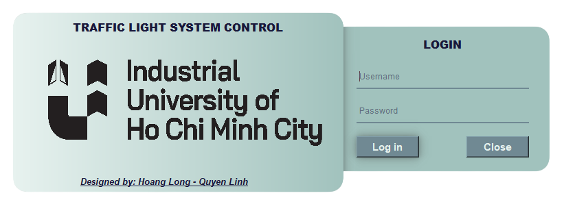
<!-- Replace with login screenshot -->

#### **2. Giám Sát Thời Gian Thực**

**Nguồn Cấp Camera**
- Hỗ trợ camera kép (USB/IP cameras)
- Phát hiện phương tiện dựa trên YOLO
- Vùng đếm dựa trên polygon
- Tối ưu FPS với TensorRT


<!-- Replace with camera interface screenshot -->

**Hiển Thị Chỉ Số Chính**
- Tổng số phương tiện mỗi vùng
- Thời gian chờ thời gian thực
- Trạng thái tín hiệu (Đỏ/Xanh/Vàng)
- Phát hiện phương tiện khẩn cấp

#### **3. Cấu Hình Bản Đồ Tương Tác**

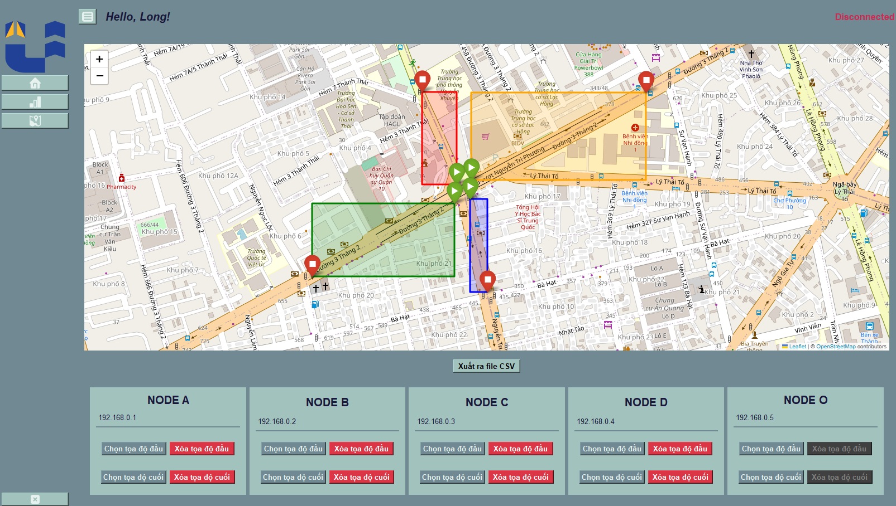
<!-- Replace with Folium map screenshot -->

**Tính Năng**:
- Click để đặt tọa độ node
- Gán địa chỉ IP
- Cấu hình bounding box
- Lưu/Nạp cấu hình sang CSV

**Quy Trình**:
1. Nhập địa chỉ IP Node
2. Click "Enable Map Selection"
3. Click trên bản đồ để đặt tọa độ
4. Đặt điểm bắt đầu/kết thúc cho mỗi tuyến
5. Lưu cấu hình vào `nodes_1.csv`

#### **4. Chế Độ Điều Khiển Giao Thông**

**Chế Độ Tự Động (AI-Controlled)**
- Model DQN đưa ra quyết định mỗi chu kỳ
- Cập nhật dựa trên số phương tiện thời gian thực
- Thích ứng với thay đổi mật độ giao thông

**Chế Độ Thủ Công**
- Ghi đè quyết định AI
- Đặt độ dài chu kỳ và thời gian xanh tùy chỉnh
- Điều khiển khẩn cấp cho sự kiện đặc biệt

### **Quy Trình Ứng Dụng**

```
1. Đăng Nhập Người Dùng
   ↓
2. Hiển Thị Dashboard
   ├── Tab Home: Nguồn Cấp Camera + Số Lượng Phương Tiện
   └── Tab Map: Cấu Hình Node
   ↓
3. Chọn Chế Độ
   ├── Chế Độ Tự Động: AI điều khiển
   └── Chế Độ Thủ Công: Người dùng điều khiển
   ↓
4. GreenWave Engine
   ├── Lấy số phương tiện từ cameras
   ├── Lấy dữ liệu giao thông từ TomTom API
   ├── Xây dựng vector trạng thái
   ├── Dự đoán DQN
   └── Gửi tín hiệu đến các node
   ↓
5. Điều Khiển Phần Cứng
   └── Raspberry Pi Pico → Đèn Giao Thông
```
---

## 📊 Kết Quả & Hiệu Suất

### **Kết Quả Huấn Luyện**

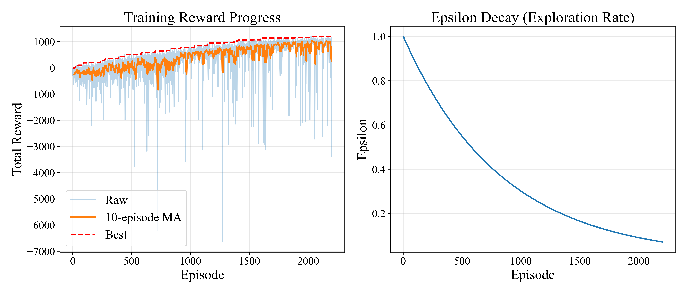
<!-- Replace with complete training charts -->
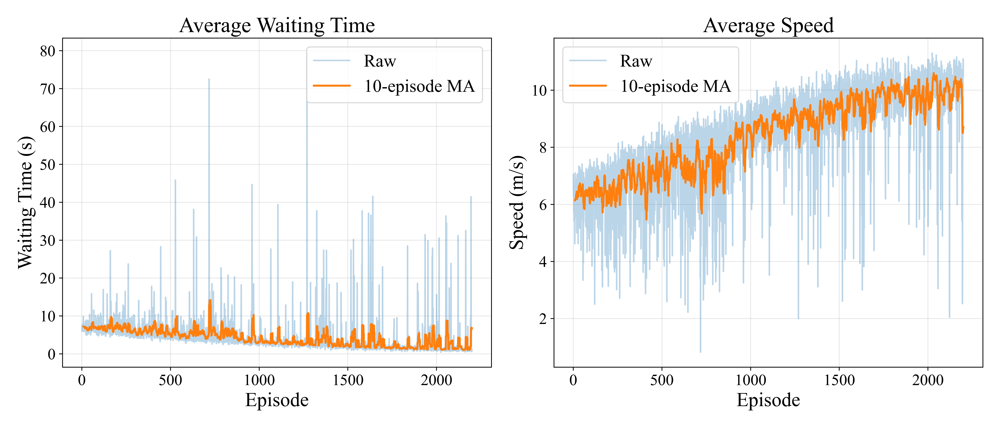
<!-- Replace with complete training charts -->

### **Hiệu Suất Kiểm Tra**

#### **Kịch Bản Giao Thông Thấp**
| Chỉ Số | DQN-GreenWave | DQN-Baseline |
|--------|---------------|--------------|
| Thời Gian Chờ TB (s) | 28.3 | 32.1 |
| Thông Lượng (xe/h) | 1,200 | 1,150 |
| Độ Dài Hàng Đợi | 2.1 | 2.8 |

#### **Kịch Bản Giao Thông Trung Bình**
| Chỉ Số | DQN-GreenWave | DQN-Baseline |
|--------|---------------|--------------|
| Thời Gian Chờ TB (s) | 45.2 | 58.7 |
| Thông Lượng (xe/h) | 1,850 | 1,620 |
| Độ Dài Hàng Đợi | 3.8 | 5.2 |

#### **Kịch Bản Giao Thông Cao**
| Chỉ Số | DQN-GreenWave | DQN-Baseline |
|--------|---------------|--------------|
| Thời Gian Chờ TB (s) | 67.8 | 89.2 |
| Thông Lượng (xe/h) | 2,100 | 1,780 |
| Độ Dài Hàng Đợi | 6.2 | 9.4 |

### **Video Minh Họa**

📹 [Xem Video Demo](https://youtu.be/1TTsjgiU7FI)
<!-- Replace with actual video link -->

---

## 🔌 Tích Hợp Phần Cứng

### **Sơ Đồ Hệ Thống**

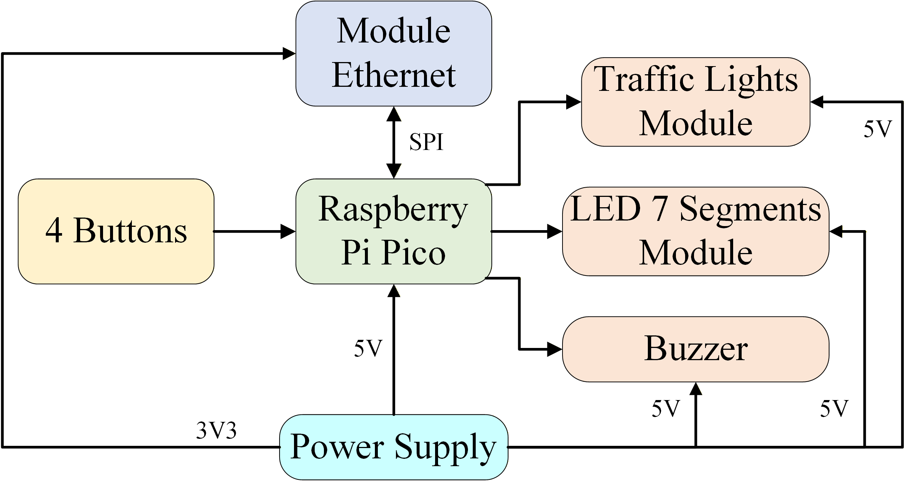
<!-- Replace with circuit/connection diagram -->

### **Linh Kiện**

| Linh Kiện | Model | Số Lượng | Mục Đích |
|-----------|-------|----------|---------|
| Vi Điều Khiển | Raspberry Pi Pico | 3 | Điều khiển node |
| Module Ethernet | WIZNET W5500 Lite  | 3 | Điều khiển node |
| Shift Register | 74HC595 | 3 | Ghép kênh LED |
| Module Đèn Giao Thông | LED 5mm Đỏ/Vàng/Xanh | 8 | Đèn giao thông |

### **Giao Thức Truyền Thông**

**Định Dạng Thông Điệp**:
```
cycle:<cycle_length>:<green_time>
```

**Ví Dụ**:
```
# Chu kỳ 60s, xanh 25s
cycle:60:25
```

**Quy Trình**:
1. GUI gửi lệnh qua socket
2. Pico nhận và phân tích thông điệp
3. 74HC595 dịch trạng thái LED
4. Đèn giao thông cập nhật tương ứng

| Lớp Trên PCB | Lớp Dưới PCB |
|:---:|:----------:|
| 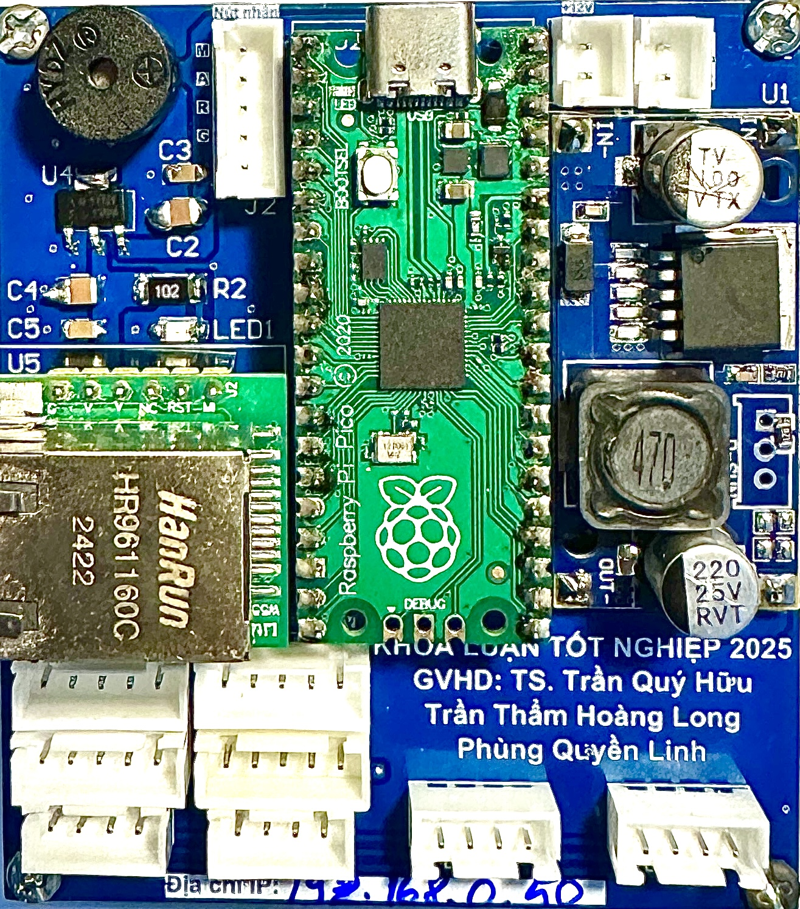 | 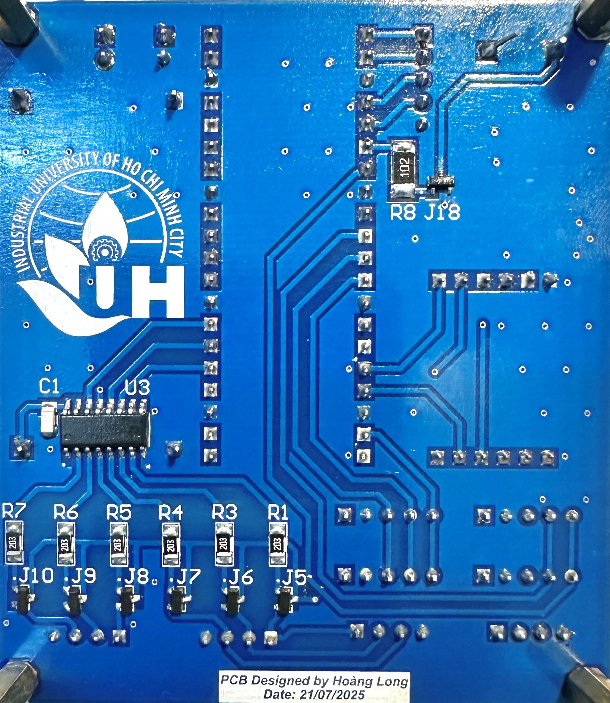 |

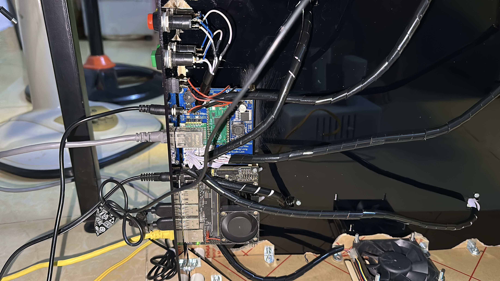

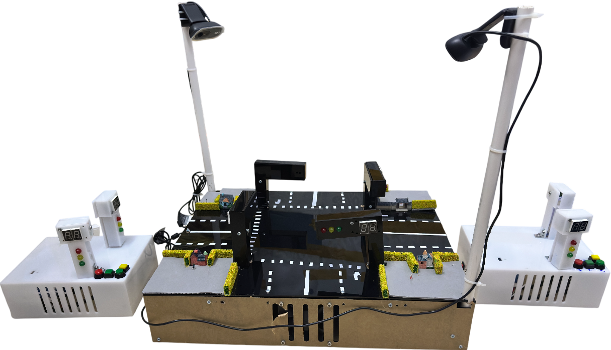
<!-- Replace with actual hardware setup photo -->

---

## 🏆 Giải Thưởng & Công Bố Khoa Học

### **Khóa Luận Tốt Nghiệp 2025**

🎓 **Bảo Vệ Thành Công Ngày 05/01/2026**

Chúng tôi đã bảo vệ thành công khóa luận tốt nghiệp với điểm số xuất sắc **9+/10**. Nhóm chúng tôi được **cộng điểm khuyến khích** vì đã thuyết trình toàn bộ buổi bảo vệ bằng tiếng Anh, thể hiện năng lực chuyên môn và khả năng giao tiếp quốc tế.

| Hình Ảnh Bảo Vệ 1 | Hình Ảnh Bảo Vệ 2 |
|:---:|:---:|
|  | 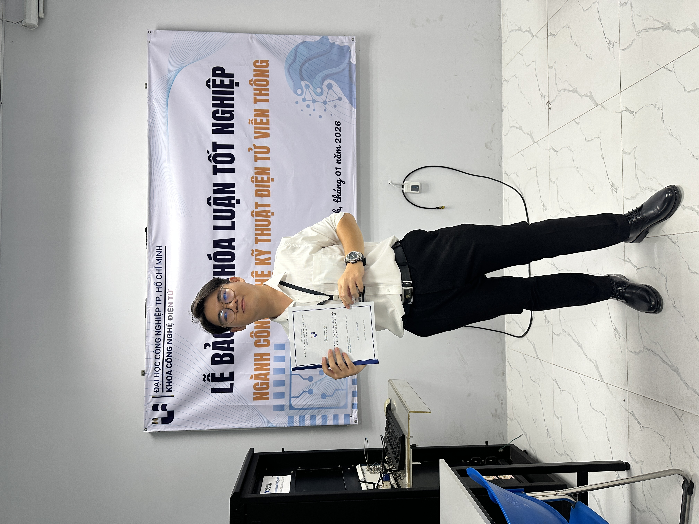 |
<!-- Thay thế bằng hình ảnh bảo vệ thực tế -->

---

### **Giải Thưởng**

🥉 **Giải Khuyến Khích Eureka 2025** - Trường Đại Học Công Nghiệp TP. Hồ Chí Minh

- **Tên Đề Tài**: "Thiết Kế Hệ Thống Điều Khiển Đèn Giao Thông Thông Minh Sử Dụng Ethernet và YOLOv5"
- **Công Nhận**: Cuộc thi nghiên cứu cấp trường
- **Năm**: 2025

### **Công Bố Khoa Học**

#### **Bài Báo Tạp Chí (Q4)**

📄 **Huu Q. Tran, Phung Quyen Linh and Tran Tham Hoang Long**, "A Smart Traffic Light Control System", *Journal of Flow Visualization and Image Processing*, 2025.
- **DOI**: [10.1615/JFlowVisImageProc.2025059776](https://doi.org/10.1615/JFlowVisImageProc.2025059776)
- **Indexed**: Scopus (Q4)
- **Trạng Thái**: Đã xuất bản

#### **Bài Báo Hội Nghị**

📄 **Huu Q. Tran, Phung Quyen Linh and Tran Tham Hoang Long**, "Design of Intelligent Traffic Light Control System Using YOLOv5 and LSTM", *Fifth International Conference on Emerging Research in Electronics, Computer Science and Technology (ICERECT 2025)*, 2025.
- **Hội Nghị**: ICERECT 2025 (Quốc tế)
- **Trạng Thái**: Đã chấp nhận/Trình bày

---

## 🙏 Lời Cảm Ơn

Dự án này được hoàn thành như một phần của đồ án tốt nghiệp tại **Trường Đại Học Công Nghiệp TP. Hồ Chí Minh**.


<!-- Replace with actual hardware setup photo -->

**Cảm Ơn Đặc Biệt**:
- **Giảng Viên Hướng Dẫn**: Trần Quý Hữu - Vì sự hướng dẫn và chỉ bảo [](https://www.facebook.com/Henry.Tran.1982)
- **Khoa**: Khoa Công Nghệ Điện Tử - Vì cung cấp tài nguyên
- **TomTom**: Vì quyền truy cập traffic API
- **SUMO Community**: Vì trình mô phỏng mã nguồn mở

**Tài Liệu Tham Khảo**:
1. Mnih, V., et al. (2015). "Human-level control through deep reinforcement learning." *Nature*.
2. Van der Pol, E., & Oliehoek, F. A. (2016). "Coordinated deep reinforcement learners for traffic light control." *NIPS*.
3. Wei, H., et al. (2018). "IntelliLight: A Reinforcement Learning Approach for Intelligent Traffic Light Control." *KDD*.
4. Redmon, J., & Farhadi, A. (2018). "YOLOv3: An Incremental Improvement." *arXiv*.

---

<div align="center">

### ⭐ Nếu bạn thấy dự án này hữu ích, hãy cho chúng tôi một ngôi sao!


<!-- Replace with a thank you image or animation -->

**Được tạo ra với ❤️ cho thành phố thông minh hơn**

</div>


